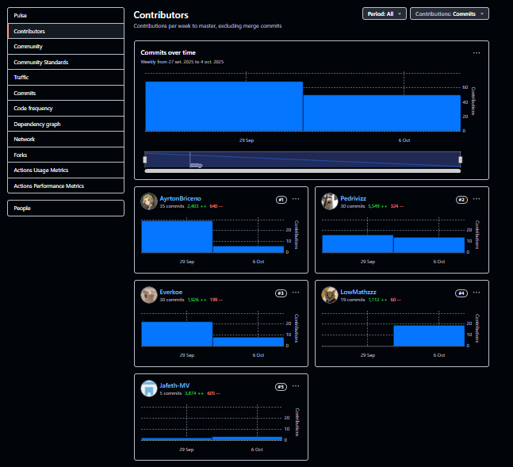
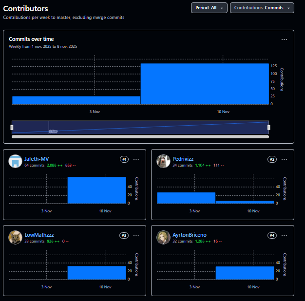

# UNIVERSIDAD PERUANA DE CIENCIAS APLICADAS

## Carrera: Ingeniería de Software
## Aplicaciones Web - Presencial
## PROFESOR: Rafael Castro
## NRC: 7470
## INFORME TB2
## START UP: WASD
## PRODUCTO: Qlic

### INTEGRANTES:

<table>
  <thead>
    <tr>
      <th style="background-color: #333; color: #fff;">Apellidos y Nombres</th>
      <th style="background-color: #333; color: #fff;">Código de Alumno</th>
    </tr>
  </thead>
  <tbody>
    <tr>
      <td>Jafeth Worren, Ynga Amado</td>
      <td>u202314715</td>
    </tr>
    <tr>
      <td>Loechle Arias, Mateo Ítalo</td>
      <td>u202215004</td>
    </tr>
    <tr>
      <td>Guia Carrasco, Pedro Andre</td>
      <td>u202212010</td>
    </tr>
    <tr>
      <td>Briceño Llanos, Ayrton Omar</td>
      <td>u202311077</td>
    </tr>
    <tr>
      <td>Anyelo Bill, Alejos Jesus</td>
      <td>u20231d149</td>
    </tr>
  </tbody>
</table>

--- 

Periodo 202520

# Registro de versiones del informe

| Versión | Fecha      | Autor                                                     | Descripción de modificación                                                                            |
|---------|------------|-----------------------------------------------------------|--------------------------------------------------------------------------------------------------------|
| 1.1     | 28/08/2025 | Briceño Llanos, Ayrton Omar                               | Creación del documento de trabajo en formato markdown.                                                 |
| 1.2     | 29/08/2025 | Briceño Llanos, Ayrton Omar                               | Redacción del startup profile y solution profile, delimitación de segmentos objetivo.                  |
| 1.3     | 2/09/2025  | Anyelo Bill, Alejos Jesus                                 | Elaboración y registro de entrevistas a segmentos objetivo, análisis de entrevistas.                   |
| 1.4     | 4/09/2025  | Briceño Llanos, Ayrton Omar                               | Elaboración de user personas, impact mapping, to-be, redacción de conclusiones, bibliografía y anexos. |
| 1.5     | 5/09/2025  | Anyelo Bill, Alejos Jesus                                 | Elaboración de user stories y epics.                                                                   |
| 1.6     | 8/09/2025  | Guia Carrasco, Pedro Andre                                | Elaboración de diagramas de contenedores, diagramas de contexto, diagramas de componentes.             |
| 1.7     | 11/09/2025 | Guia Carrasco, Pedro Andre                                | Registro de evidencias del Sprint 1.                                                                   |
| 1.8     | 12/09/2025 | Jafeth Worren, Ynga Amado                                 | Diseño de mockups, elaboración de wire-flows y user-flows para la landing page.                        |
| 1.9     | 13/09/2025 | Guia Carrasco, Pedro Andre                                | Elaboración de diagrama de base de datos,diagrama de clases, diccionario de clases.                    |
| 1.10    | 15/09/2025 | Jafeth Worren, Ynga Amado                                 | Despliegue de la landing page.                                                                         |
| 1.11    | 15/09/2025 | Loechle Arias, Mateo Ítalo                                | Diseño de wireframes y mockups de la aplicación web.                                                   |
| 2.0     | 29/09/2025 | Guia Carrasco, Pedro Andre                                | Creación del repositorio de la aplicación web.                                                         |
| 2.1     | 03/10/2025 | Briceño Llanos, Ayrton Omar                               | Creación del dashboard del Qlic.                                                                       |
| 2.2     | 03/10/2025 | Briceño Llanos, Ayrton Omar                               | Creación del bounded context Profile                                                                   |
| 2.3     | 03/10/2025 | Anyelo Bill, Alejos Jesus                                 | Creación del bounded context Reports                                                                   |
| 2.4     | 03/10/2025 | Guia Carrasco, Pedro Andre   Jafeth Worren, Ynga Amado | Creación del bounded context Notifications                                                             |
| 2.5     | 03/10/2025 | Guia Carrasco, Pedro Andre   Jafeth Worren, Ynga Amado | Creación del bounded context core Anomaly Detection                                                    |
| 2.6     | 05/10/2025 | Loechle Arias, Mateo Ítalo                                | Creación del bounded context Payments                                                                  |
| 2.7     | 06/10/2025 | Guia Carrasco, Pedro Andre                                | Creación del bounded context Subscriptions                                                             |
| 2.8     | 06/10/2025 | Guia Carrasco, Pedro Andre                                | Despliegue del frontend                                                                                |
| 3.0     | 04/11/2025 | Guia Carrasco, Pedro Andre                                | Creación del repositorio del backend                                                                   |
| 3.1     | 05/11/2025 | Briceño Llanos, Ayrton Omar                               | Creación de endpoints Authentication y Profiles                                                        |
| 3.2     | 06/11/2025 | Guia Carrasco, Pedro Andre                                | Creación del endpoint Alerts                                                                           |
| 3.3     | 07/11/2025 | Jafeth Worren, Ynga Amado                                 | Creación del endpoint Anomaly Detection                                                                |
| 3.4     | 07/11/2025 | Loechle Arias, Mateo Ítalo                                | Creación del endpoints Payments y Subscriptions                                                        |
| 3.5     | 09/11/2025 | Anyelo Bill, Alejos Jesus                                 | Creación del endpoints Reports y Usage Management                                                      |

# Project Report Collaboration Insights

#### Repositorio del informe del proyecto
El informe del proyecto se encuentra alojado en el siguiente repositorio de la organización de GitHub del equipo:

- 🔗 Enlace de la organización: https://github.com/wasd25
- 🔗 Enlace de repositorios: https://github.com/orgs/wasd25/repositories

A continuación, se detallan las actividades realizadas en cada entrega, la participación de los miembros del equipo, y las evidencias correspondientes.

## TB1
Para la primera entrega (TB1) se trabajó en la estructura inicial del informe, definiendo el índice y distribuyendo las secciones entre los miembros.

## TP1
Para este entregable se realizó el desarrollo del sprint 2 que corresponde al desarrollo del frontend de Qlic.

## TB2
Para este entregable se realizó el desarrollo del sprint 3 que corresponde al desarrollo del backend de Qlic.

# Contenido

## Tabla de Contenidos

### [Registro de versiones del informe](#registro-de-versiones-del-informe)
### [Project Report Collaboration Insights](#project-report-collaboration-insights)
### [Contenido](#contenido)
### [Student Outcome](#student-outcome-1)
### [Capítulo I: Introducción]()
- [1.1. Startup Profile]()
    - [1.1.1. Descripción de la Startup]()
    - [1.1.2. Perfiles de integrantes del equipo]()
- [1.2. Solution Profile]()
    - [1.2.1 Antecedentes y problemática]()
    - [1.2.2 Lean UX Process]()
        - [1.2.2.1. Lean UX Problem Statements]()
        - [1.2.2.2. Lean UX Assumptions]()
        - [1.2.2.3. Lean UX Hypothesis Statements]()
        - [1.2.2.4. Lean UX Canvas]()
- [1.3. Segmentos objetivos]()

### [Capítulo II: Requirements Elicitation & Analysis]()
- [2.1. Competidores]()
    - [2.1.1. Análisis competitivo]()
    - [2.1.2. Estrategias y tácticas frente a competidores]()
- [2.2. Entrevistas]()
    - [2.2.1. Diseño de entrevistas]()
    - [2.2.2. Registro de entrevistas]()
    - [2.2.3. Análisis de entrevistas]()
- [2.3. Needfinding]()
    - [2.3.1. User Persona]()
    - [2.3.2. User Task Matrix]()
    - [2.3.3. User Journey Mapping]()
    - [2.3.4. Empathy Mapping]()
    - [2.3.5. As-is Scenario Mapping]()
    - [2.4. Ubiquitous Language]()
### [Capítulo III: Requirements Specification]()
- [3.1. To-Be Scenario Mapping]()
- [3.2. User Stories]()
- [3.3. Impact Mapping]()
- [3.4. Product Backlog]()

### [Capítulo IV: Product Design]()
- [4.1. Style Guidelines]()
    - [4.1.1. General Style Guidelines]()
    - [4.1.2. Web Style Guidelines]()
- [4.2. Information Architecture]()
    - [4.2.1. Organization Systems]()
    - [4.2.2. Labeling Systems]()
    - [4.2.3. SEO Tags and Meta Tags]()
    - [4.2.4. Searching Systems]()
    - [4.2.5. Navigation Systems]()
- [4.3. Landing Page UI Design]()
    - [4.3.1. Landing Page Wireframe]()
    - [4.3.2. Landing Page Mock-up]()
- [4.4. Web Applications UX/UI Design]()
    - [4.4.1. Web Applications Wireframes]()
    - [4.4.2. Web Applications Wireflow Diagrams]()
    - [4.4.3. Web Applications Mock-ups]()
    - [4.4.4. Web Applications User Flow Diagrams]()
- [4.5. Web Applications Prototyping]()
- [4.6. Domain-Driven Software Architecture]()
    - [4.6.1. Software Architecture Context Diagram]()
    - [4.6.2. Software Architecture Container Diagrams]()
    - [4.6.3. Software Architecture Components Diagrams]()
- [4.7. Software Object-Oriented Design]()
    - [4.7.1. Class Diagrams]()
    - [4.7.2. Class Dictionary]()
- [4.8. Database Design]()
    - [4.8.1. Database Diagram]()
### [Capítulo V: Product Implementation, Validation & Deployment]()
- [5.1. Software Configuration Management]()
    - [5.1.1. Software Development Environment Configuration]()
    - [5.1.2. Source Code Management]()
    - [5.1.3. Source Code Style Guide & Conventions]()
    - [5.1.4. Software Deployment Configuration]()
- [5.2. Landing Page, Services & Applications Implementation]()
    - [5.2.1. Sprint 1]()
        - [5.2.1.1. Sprint Planning 1]()
        - [5.2.1.2. Sprint Backlog 1]()
        - [5.2.1.3. Development Evidence for Sprint Review]()
        - [5.2.1.4. Testing Suite Evidence for Sprint Review]()
        - [5.2.1.5. Execution Evidence for Sprint Review]()
        - [5.2.1.6. Services Documentation Evidence for Sprint Review]()
        - [5.2.1.7. Software Deployment Evidence for Sprint Review]()
        - [5.2.1.8. Team Collaboration Insights during Sprint]()
    - [5.2.2. Sprint 2]()
        - [5.2.2.1. Sprint Planning 2]()
        - [5.2.2.2. Sprint Backlog 2]()
        - [5.2.2.3. Development Evidence for Sprint Review]()
        - [5.2.2.4. Testing Suite Evidence for Sprint Review]()
        - [5.2.2.5. Execution Evidence for Sprint Review]()
        - [5.2.2.6. Services Documentation Evidence for Sprint Review]()
        - [5.2.2.7. Software Deployment Evidence for Sprint Review]()
        - [5.2.2.8. Team Collaboration Insights during Sprint]()
    - [5.2.3. Sprint 3]()
        - [5.2.3.1. Sprint Planning 3]()
        - [5.2.3.2. Sprint Backlog 3]()
        - [5.2.3.3. Development Evidence for Sprint Review]()
        - [5.2.3.4. Testing Suite Evidence for Sprint Review]()
        - [5.2.3.5. Execution Evidence for Sprint Review]()
        - [5.2.3.6. Services Documentation Evidence for Sprint Review]()
        - [5.2.3.7. Software Deployment Evidence for Sprint Review]()
        - [5.2.3.8. Team Collaboration Insights during Sprint]()
- [5.3. Validation Interviews]()
    - [5.3.1. Diseño de Entrevistas]()
    - [5.3.2. Registro de Entrevistas]()
    - [5.3.2. Evaluaciones según heurísticas]()
- [5.4. Video About-the-Product]()
- [Conclusiones]()
    - [Conclusiones y Recomendaciones]()
    - [Video About-the-Team]()
- [Bibliografía]()
- [Anexos]()

# Student Outcome

ABET – EAC - Student Outcome 3

Se refiere a la capacidad de comunicarse efectivamente con un rango de audiencias.
En el siguiente cuadro se describe las acciones realizadas y enunciados de
conclusiones por parte del grupo, que permiten sustentar el haber alcanzado el logro
del ABET – EAC - Student Outcome 3.

| Criterio específico                                                   | Acciones realizadas                                                                                                                                                                                                                                                                                                                                                                                                                                                                                                                                                                                                                                                                                                                                                                                                                                                                                                                                                                                                                                                                                                                                                                                                                                                                                                                                                                                                                                                                                                                                                                                                                                                                                                                                                                                                                                                                                                                                                                                                                                                                                                                                                                                                                                                                                                                                                                                                                                                                                                                                                                                                                                                                                                                                                                                                                                                                                                                                                                                                                                                                                                                                                                                                                                                                                                                                                                                                                                                                                                                                                                                                                                                                                                                                                                                                                                                                                                                                                                                                                                                                                                                                                                                                                                                                                                                                                                                                                                                                                                                                                                                                                                                                                                                                                                                                                                                                                                                                                                                                                                                                                                                                                                                                                                                                                                                                                                                                                                                                                                                                                                                                                                                                                                                                                                                                                                                                                                                                                                                                                                                                                                                                                                                                                                                                                                                                                                                                                                                                                                                                                                                                                                                                                                                                                                                                                                                                                                                                                                                                                                                                                                                                                                                                                                                                                                                                                                                                                                                                                                                                                                                                     | Conclusiones                                                                                                                                                                                                                                                                                                                                                                                                                                                                                                                                                                                                                                                                                                                                                                                                                                    |
|-----------------------------------------------------------------------|-------------------------------------------------------------------------------------------------------------------------------------------------------------------------------------------------------------------------------------------------------------------------------------------------------------------------------------------------------------------------------------------------------------------------------------------------------------------------------------------------------------------------------------------------------------------------------------------------------------------------------------------------------------------------------------------------------------------------------------------------------------------------------------------------------------------------------------------------------------------------------------------------------------------------------------------------------------------------------------------------------------------------------------------------------------------------------------------------------------------------------------------------------------------------------------------------------------------------------------------------------------------------------------------------------------------------------------------------------------------------------------------------------------------------------------------------------------------------------------------------------------------------------------------------------------------------------------------------------------------------------------------------------------------------------------------------------------------------------------------------------------------------------------------------------------------------------------------------------------------------------------------------------------------------------------------------------------------------------------------------------------------------------------------------------------------------------------------------------------------------------------------------------------------------------------------------------------------------------------------------------------------------------------------------------------------------------------------------------------------------------------------------------------------------------------------------------------------------------------------------------------------------------------------------------------------------------------------------------------------------------------------------------------------------------------------------------------------------------------------------------------------------------------------------------------------------------------------------------------------------------------------------------------------------------------------------------------------------------------------------------------------------------------------------------------------------------------------------------------------------------------------------------------------------------------------------------------------------------------------------------------------------------------------------------------------------------------------------------------------------------------------------------------------------------------------------------------------------------------------------------------------------------------------------------------------------------------------------------------------------------------------------------------------------------------------------------------------------------------------------------------------------------------------------------------------------------------------------------------------------------------------------------------------------------------------------------------------------------------------------------------------------------------------------------------------------------------------------------------------------------------------------------------------------------------------------------------------------------------------------------------------------------------------------------------------------------------------------------------------------------------------------------------------------------------------------------------------------------------------------------------------------------------------------------------------------------------------------------------------------------------------------------------------------------------------------------------------------------------------------------------------------------------------------------------------------------------------------------------------------------------------------------------------------------------------------------------------------------------------------------------------------------------------------------------------------------------------------------------------------------------------------------------------------------------------------------------------------------------------------------------------------------------------------------------------------------------------------------------------------------------------------------------------------------------------------------------------------------------------------------------------------------------------------------------------------------------------------------------------------------------------------------------------------------------------------------------------------------------------------------------------------------------------------------------------------------------------------------------------------------------------------------------------------------------------------------------------------------------------------------------------------------------------------------------------------------------------------------------------------------------------------------------------------------------------------------------------------------------------------------------------------------------------------------------------------------------------------------------------------------------------------------------------------------------------------------------------------------------------------------------------------------------------------------------------------------------------------------------------------------------------------------------------------------------------------------------------------------------------------------------------------------------------------------------------------------------------------------------------------------------------------------------------------------------------------------------------------------------------------------------------------------------------------------------------------------------------------------------------------------------------------------------------------------------------------------------------------------------------------------------------------------------------------------------------------------------------------------------------------------------------------------------------------------------------------------------------------------------------------------------------------------------------------------------------------------------------------------------------------|-------------------------------------------------------------------------------------------------------------------------------------------------------------------------------------------------------------------------------------------------------------------------------------------------------------------------------------------------------------------------------------------------------------------------------------------------------------------------------------------------------------------------------------------------------------------------------------------------------------------------------------------------------------------------------------------------------------------------------------------------------------------------------------------------------------------------------------------------|
| Comunica oralmente con efectividad a diferentes rangos de audiencia.  | **TB1:**    **Ayrton Briceño:** Durante el trabajo parcial, participé activamente en la elaboración del informe y en la coordinación general del equipo. Me aseguré de comunicar por escrito de manera clara las ideas, hallazgos y descripciones requeridas en el informe, adaptando el lenguaje para que fuera comprensible tanto para los miembros del equipo como para lectores externos. Además, durante las reuniones virtuales por Discord, compartí observaciones clave sobre las necesidades de los usuarios entrevistados y propuse ajustes en las tareas asignadas, fomentando el consenso mediante una comunicación oral directa y efectiva. Esta experiencia fortaleció mi capacidad para transmitir ideas con claridad y adaptar el mensaje a distintos públicos, tanto en contextos escritos como orales.    **Mateo Loeche:** Complementé la comunicación del equipo al participar en las reuniones virtuales, aportando sugerencias para optimizar la presentación de ideas y colaborando en la clarificación de conceptos técnicos durante las discusiones.    **Pedro Guía:** Participé activamente en las reuniones virtuales del equipo, compartiendo ideas y proponiendo mejoras en la estructura de nuestras presentaciones. Además, apoyé en la explicación de temas técnicos para asegurar que todos comprendieran los conceptos clave y se mantuviera una comunicación efectiva.    **Anyelo Alejos:** Durante el desarrollo del proyecto, me encargué de organizar y redactar varias secciones clave como los antecedentes, el análisis de entrevistas y los escenarios de usuario. Me enfoqué en que todo estuviera claro y bien estructurado, usando un lenguaje sencillo pero preciso para que cualquier persona pudiera entenderlo. También participé en reuniones virtuales donde compartí ideas sobre cómo mejorar los mapas de usuario y cómo presentar los resultados de forma más visual. Propuse ajustes en el estilo del informe y ayudé a definir cómo explicar los conceptos técnicos sin que suenen complicados. Esta experiencia me ayudó a mejorar mi forma de comunicarme, tanto al hablar como al escribir, adaptando el mensaje según el público y el objetivo de cada parte del trabajo.    **Jafeth Ynga Amado:** Durante el trabajo participé activamente en las reuniones de coordinación, aportando ideas y sugerencias para mejorar el trabajo. Apoyé en la colaboración para desarrollar la landing page y los diseños wireframe y mockup. Expliqué el funcionamiento del código para que todos los integrantes sepan qué parte editar si se requiere.    **TP1:**    **Ayrton Briceño :** Durante el desarrollo del frontend del módulo *Profiles*, participé activamente en las reuniones virtuales por Discord, donde expliqué la estructura de los componentes y cómo se integrarían con el resto del sistema. Me aseguré de comunicar claramente las necesidades de diseño y funcionalidad del módulo, adaptando el lenguaje técnico según la experiencia de cada integrante. Además, coordiné con el equipo de *Notifications* y *Payments* para mantener la coherencia visual y funcional entre módulos. Esta experiencia fortaleció mi capacidad de comunicar ideas técnicas de forma efectiva, tanto oralmente como en la colaboración grupal.    **Mateo Loechle :** Colaboré en la explicación del flujo de pagos dentro del sistema Qlic, exponiendo oralmente la lógica de interacción entre los componentes y las validaciones del formulario. En las reuniones del equipo, propuse mejoras visuales y en la usabilidad de la vista *Membership Plan*, asegurando que el mensaje fuera comprendido tanto por compañeros técnicos como por quienes revisaban el diseño final.    **Pedro Guía :** Durante el desarrollo del frontend, participé activamente en la coordinación del equipo para la integración de los módulos *Notifications*, *Anomaly Detection* y *Subscriptions*. En las reuniones, expliqué el funcionamiento de cada vista y los eventos que conectan con las APIs, facilitando la comprensión técnica de los flujos. Además, propuse soluciones para mejorar la comunicación entre componentes y asegurar una experiencia de usuario consistente.    **Anyelo Alejos :** Me encargué de comunicar el progreso y las decisiones técnicas tomadas en el módulo *Reports*, explicando al equipo la lógica de visualización de los reportes generados. Durante las reuniones, expuse las ventajas del diseño propuesto y cómo este ayudaba a la comprensión de los datos por parte del usuario. También sugerí cambios en el layout general para mantener la coherencia visual entre los módulos.    **Jafeth Ynga Amado :** Participé en las reuniones virtuales coordinando junto a Pedro el desarrollo de los módulos *Notifications* y *Anomaly Detection*. Expliqué las funciones implementadas, el manejo de datos y cómo los usuarios interactuarían con las alertas. Además, compartí mis observaciones sobre la integración con otros módulos y propuse ajustes para optimizar la experiencia de uso general del sistema.   **TB2**    **Ayrton Briceño:**   En esta entrega, ejercí un rol activo en el trabajo en equipo al liderar y colaborar de manera conjunta con mis compañeros en el desarrollo del proyecto. Como responsable del bounded context de Profile e IAM, no solo cumplí con mis tareas técnicas, sino que también apoyé a otros integrantes para que cumplan con sus entregables, resolviendo dudas y proponiendo soluciones. Fomenté una dinámica en la que todos pudimos aportar y avanzar hacia un objetivo común: desarrollar QLIC de forma eficiente y cumpliendo con los criterios del project statement.    **Pedro Guía:**    En este entregable realize junto a mis compañeros un buen trabajo en equipo mediante el desarrollo del backend. En mi caso, realize el bounded context Alerts ya que es el mismo que realize en el entregable anterior.r    **Mateo Loechle:**    Durante este proyecto, mi comunicación se adaptó a dos audiencias clave. Por un lado, realicé entrevistas y reuniones con dueños de PYMEs para levantar los requerimientos. Usé un lenguaje de negocio, enfocado en sus procesos, para entender cómo gestionaban sus cobros y suscripciones. Esto fue crucial para diseñar los Bounded Contexts de "Payments" y "Subscriptions" de forma que resolvieran sus necesidades reales. Por otro lado, en las reuniones técnicas internas, presenté el diseño del API al equipo de desarrollo (frontend). Usando Swagger como apoyo visual, expliqué oralmente la lógica, el flujo de datos entre los contextos y cómo consumir cada endpoint, asegurando que pudieran integrarse sin bloqueos.    **Jafeth Ynga:**    Durante esta etapa, mi comunicación se adaptó a las necesidades técnicas y de coordinación del equipo. Por un lado, en las reuniones técnicas, expliqué a mis compañeros la arquitectura y la lógica de negocio de los Bounded Contexts que desarrollé (Anomaly Detection y Usage Management), detallando cómo procesaban la información y los servicios que exponían para su integración. Por otro lado, en las coordinaciones generales, me mantuve como un miembro activo, comunicando mis avances y ofreciendo apoyo en otras áreas que necesitaban ayuda, como en la definición de las actividades de Responsabilidad Social.    **Anyelo Bill:**    Durante esta etapa, mi comunicación se adaptó a dos públicos muy distintos. Por un lado, realicé entrevistas a usuarios de PYMEs y hogares, donde les mostré la plataforma Qlic y les expliqué su funcionamiento de forma sencilla para recoger su feedback sobre posibles mejoras. Por otro lado, en las reuniones internas, expliqué a mi equipo la lógica técnica del backend del módulo de Reportes que desarrollé, detallando cómo funcionaban los endpoints y la seguridad para que pudieran integrarlo al frontend sin problemas. | Adaptamos nuestra forma de comunicarnos según el perfil de la audiencia, utilizando códigos y recursos adecuados para asegurar la correcta transmisión del mensaje. Empleamos medios audiovisuales pertinentes al contenido presentado, y verificamos constantemente que la comunicación haya sido clara y efectiva. Durante la presentación de resultados, orientamos nuestro discurso hacia los objetivos específicos, garantizando la comprensión del mensaje. Además, practicamos la escucha activa y objetiva antes de emitir juicios, promoviendo siempre el diálogo y la conciliación. En el TP1, reforzamos estas habilidades mediante la exposición de avances técnicos, la coordinación oral entre módulos y la presentación conjunta del progreso del frontend, asegurando una comunicación clara y colaborativa en todas las etapas. |
| Comunica por escrito con efectividad a diferentes rangos de audiencia | **TB1:**    **Ayrton Briceño:** En esta entrega, puse en práctica mis habilidades de comunicación escrita al coordinar eficazmente con mis compañeros mediante plataformas como WhatsApp. Asimismo, contribuí activamente en la elaboración de los documentos compartidos, asegurando una redacción clara y coherente. Estas acciones me ayudaron a mantener una comunicación constante con el equipo y a reforzar la organización general del trabajo.    **Mateo Loeche:** Aporté en la redacción y revisión de los documentos finales, cuidando la claridad, cohesión y ortografía, además de verificar que la información transmitida se ajustara al público objetivo.    **Pedro Guía:** En este trabajo, me enfoqué en mantener una comunicación fluida con el equipo, facilitando la resolución de dudas y organizando la información necesaria para cumplir con los objetivos planteados.    **Anyelo Alejos:** En esta entrega, participé en la redacción de secciones como el análisis de entrevistas, escenarios de usuario y guías de estilo. Me aseguré de que el contenido fuera claro y fácil de entender, evitando tecnicismos innecesarios. También colaboré en la revisión del informe completo para mantener una estructura coherente y un lenguaje uniforme. Usamos herramientas como Google Docs y WhatsApp para coordinar los aportes, lo que permitió mantener una comunicación constante y una buena organización del trabajo.    **Jafeth Ynga Amado:** En este trabajo pude comunicarme de una manera cordial y eficiente con mis compañeros, contribuyendo activamente con la elaboración de distintas partes del documento como las hojas de estilos, los detalles que tendrá la landing page y en la revisión constante con lo que respecta a la landing page y app web. Utilizamos herramientas como Discord, WhatsApp y Github para poder comunicarme con mis compañeros y desarrollar satisfactoriamente el proyecto.    **TP1:**    **Ayrton Briceño :** Redacté la actualización del informe correspondiente al módulo *Profiles*, describiendo de forma clara la estructura de los componentes y sus funcionalidades principales. Utilicé un lenguaje técnico accesible para facilitar la comprensión de los lectores no especializados. Además, documenté los flujos de interacción y contribuí a mantener la coherencia en el formato del documento general.    **Mateo Loechle :** Contribuí en la documentación del módulo *Payments*, detallando la lógica de los formularios y la validación de datos. Me aseguré de mantener un lenguaje claro y profesional, revisando la redacción y la ortografía para conservar la uniformidad del informe. También ayudé en la integración de la información visual con las secciones de código y funcionalidad.    **Pedro Guía :** Redacté las secciones del informe relacionadas con los módulos *Notifications*, *Anomaly Detection* y *Subscriptions*, explicando las decisiones técnicas, los componentes utilizados y las interacciones con otros módulos. Mantuve una estructura clara y ordenada, usando lenguaje formal y descriptivo para que tanto los lectores técnicos como no técnicos comprendieran el desarrollo realizado.    **Anyelo Alejos :** Participé en la elaboración escrita de la sección *Reports*, explicando las funcionalidades del módulo y cómo el diseño de interfaz mejora la interpretación de los datos. Redacté descripciones técnicas con un enfoque claro y preciso, evitando tecnicismos innecesarios y manteniendo la coherencia visual del documento.    **Jafeth Ynga Amado :** Contribuí en la redacción de los apartados de *Notifications* y *Anomaly Detection*, describiendo el flujo de alertas y el análisis visual de anomalías. Me enfoqué en mantener un lenguaje claro, estructurado y comprensible, apoyándome en recursos visuales (capturas, diagramas) para reforzar la explicación escrita. También participé en la revisión general del informe para asegurar consistencia en estilo y terminología.    **TB2**    **Ayrton Briceño:**    En esta entrega, me esforcé por crear un entorno de trabajo colaborativo e inclusivo, donde todos los integrantes del equipo pudieran participar activamente. Utilicé herramientas como Trello y GitHub Projects para organizar y planificar tareas, establecer metas claras y hacer seguimiento del avance del equipo. A través de esta planificación conjunta, logramos cumplir los objetivos de la entrega a tiempo, manteniendo una comunicación constante y un ambiente de apoyo mutuo entre todos los miembros.    **Pedro Guia**    Con respecto al entregable, durante el desarrollo del backend el equipo y yo fomentamos un buena comunicacion con respecto a la creaciòn de la base datos y asi poder visualizar nuestro producto en la plataforma Swagger    **Mateo Loechle:**    Mi principal responsabilidad en la comunicación escrita fue generar la documentación técnica "viva" del proyecto. Me encargué de documentar todo el API de "Payments" y "Subscriptions" utilizando Swagger (OpenAPI). Redacté descripciones claras para cada endpoint, definí con precisión los schemas de request y response, y documenté los posibles códigos de error. El objetivo era crear un "contrato" formal y sin ambigüedades que permitiera al equipo de frontend trabajar en paralelo. Adicionalmente, el script de deploy de la base de datos que preparé sirve como un documento escrito que define el modelo de datos, comunicando la estructura y las relaciones de la información a cualquier miembro del equipo.    **Jafeth Ynga:**    Me enfoqué en la creación de la documentación y los artefactos clave para el proyecto. Para el trabajo de Responsabilidad Social, redacté los guiones detallados de la actividad y proporcioné los scripts (código) necesarios para su ejecución. Adicionalmente, elaboré la base del informe del proyecto, estructurando el documento para que el equipo pudiera consolidar sus aportes de manera ordenada. Mi objetivo fue que tanto los guiones como la estructura del informe fueran claros y precisos, facilitando el trabajo del resto del grupo.    **Anyelo Bill:**    Me encargué de documentar técnicamente todo el módulo de Reportes. Redacté las historias de usuario y definí los criterios de aceptación para las funciones de crear, listar, buscar, actualizar y eliminar reportes. Me enfoqué en describir claramente los escenarios de éxito y error de la API, asegurándome de que la redacción fuera precisa y ordenada para que el resto del equipo pudiera                                                                                                                                                                                                                                                                                                                                                                                                                                                                                                                                                                                                                                                                                                                                                                                                                                                                                                                                                                                                                                                                                                                                                                                                                                                                                                                                                                                                                                                                                                                                                                                                                                                                                                                                                                                                                                                                                                                                                                                                                                           | Elaboramos informes técnicos siguiendo los estándares establecidos para el desarrollo de proyectos de ingeniería, asegurando la calidad del contenido antes de su entrega. Nos esforzamos por transmitir ideas y conceptos clave de forma clara y empática, adaptando el nivel de detalle y el lenguaje escrito a las características del público, independientemente de su especialidad o jerarquía. En el TP1, reforzamos estas habilidades al documentar detalladamente el desarrollo del frontend de Qlic, aplicando coherencia, precisión y uniformidad en todas las secciones. Utilizamos herramientas colaborativas (Google Docs, GitHub, Discord) para mantener la comunicación y revisión constante del documento, garantizando la presentación final con todos los atributos de calidad.                                              |
