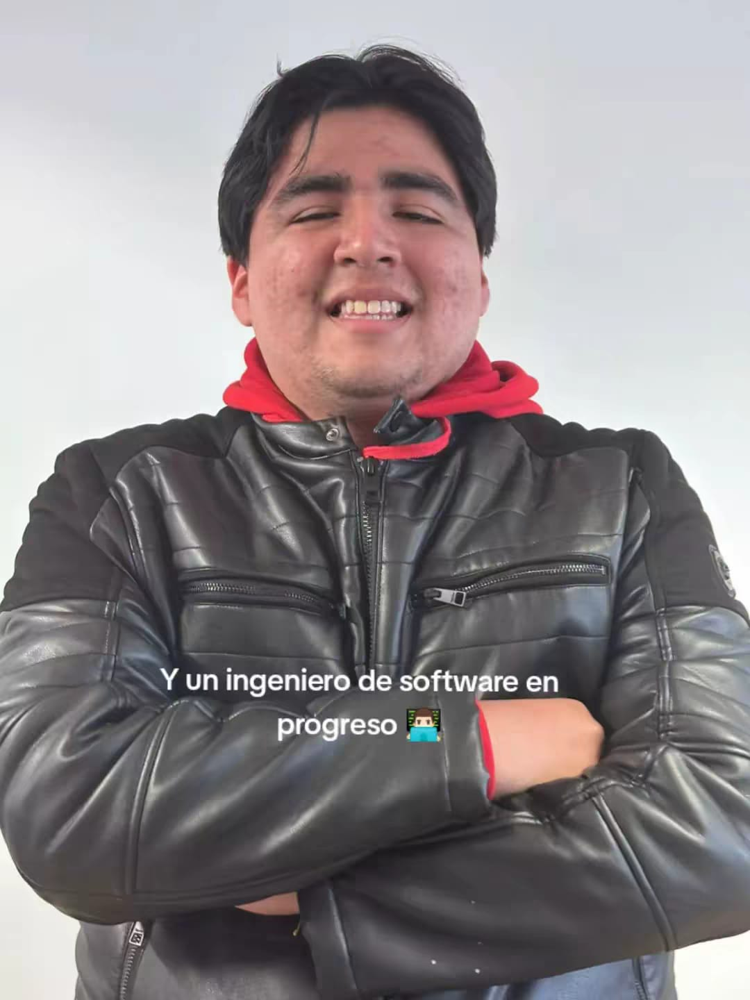
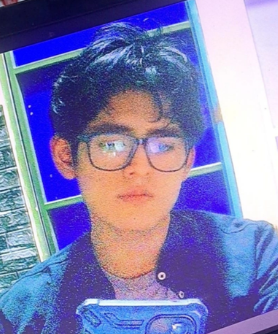

# Capítulo I: Introducción

## 1.1. Startup Profile

A continuación, se brindará información sobre a qué se dedica nuestra empresa, WASD.

### 1.1.1. Descripción de la Startup

WASD es una startup enfocada en la gestión inteligente del agua. Utilizamos tecnología IoT para optimizar el uso del recurso en negocios y hogares. La compañía combina sensores, analítica de datos y una plataforma digital para transformar la manera en que las personas administran su agua.

- **Misión:** Ayudar a negocios y hogares a optimizar el uso de agua, reducir desperdicios, disminuir costos y garantizar el reabastecimiento oportuno.
- **Visión:** Ser la empresa más importante en Perú, en el ámbito de gestión y optimización de agua con el uso de soluciones tecnológicas.
- **Producto:** "Qlic" es un servicio el cual permite el monitoreo de puntos críticos del agua en hogares o pequeñas y medianas empresas , optimizando el uso de líquidos, reduciendo desperdicios y disminuyendo costos además de garantizar el reabastecimiento oportuno.

### 1.1.2. Perfiles de integrantes del equipo

| Foto de perfil                                   | Apellido y Nombre                        | Carrera                | Acerca de                                                                                                                  | Habilidades                                                              |
|--------------------------------------------------|------------------------------------------|------------------------|----------------------------------------------------------------------------------------------------------------------------|--------------------------------------------------------------------------|
|      | Briceño Llanos, Ayrton Omar (u202311077) | Ingeniería de Software | Me apasiona el desarrollo de Software y la creación de soluciones tecnológicas que impacten positivamente en las personas. | JavaScript, C++, HTML, CSS, C#, MongoDB, SQL server, Angular, Vue.       |
|    | Guia Carrasco, Pedro Andre   (u202212010) | Ingenieria de Software | Soy Pedro Guia, estudiante de la UPC. Estoy llevando mi cuarto año en la universidad y sigo firme a mis logros a futuro.   | Java, Python, HTML, CSS, JavaScript, Angular, MySQL.                     |
|    | Loechle Arias, Mateo Italo   (u202215004) | Ingenieria de Software | Me interesa mucho el mundo de el desarrollo de software , y mejorar mis habilidades blandas con respecto a mi carrera.     | Java, Python , SQL , MongoDB, Sprinboot , Angular , Vue , Firebase, etc. |
|  | Ynga Amado, Jafeth Worren   (u202314715) | Ingenieria de Software | Soy Jafeth, estudiante de 6to ciclo de ing. de software en la UPC y quiero poder crear soluciones eficientes que tengan un impacto en la sociedad. | C++, HTML, CSS, Python, MySQL, MongoDB.                                  |
|  | Alejos Jesus, Anyelo Bill   (u20231d149) | Ingenieria de Software | Me considero una persona responsable y proactiva para dar lo mejor de mi en el proyecto que se realizará. | C++, HTML, CSS, Python.                                                  |

## 1.2. Solution Profile

**Product Name:** Qlic  
**Product Description:** Qlic, es una Web App que tiene como objetivo optimizar la gestión del agua. Para ello, este permite al usuario monitorear los IoT que este tiene, mostrando información útil, ayudando a optimizar el uso de agua, reducir desperdicios, disminuir costos y garantizar el reabastecimiento oportuno. Qlic puede usarse en negocios y hogares con el fin de optimizar varios procesos.
**Monetización:** Qlic funciona mediante un modelo de suscripción mensual o anual, en el cual se alquila el servicio de la aplicación y los diferentes dispositivos IoT.

**Plan Básico:**

Ideal para negocios que desean iniciar en la digitalización operativa con funciones esenciales.

- Dispositivos IoT para cada grifo de la casa.
- Reportes semanales del estado de los dispositivos IoT.
- Recomendaciones de cómo minimizar gastos.
- Cálculo del agua consumida mensualmente y especificaciones clave para conocer qué es lo que consume la mayor cantidad de agua.
- Instalación gratuita.
- Soporte técnico en horario laboral
- Monitoreo en tiempo real de temperatura y humedad en cámaras y vitrinas.

**Plan Gestión Pro:**

Pensado para hogares que requieren mayor control, eficiencia operativa y soporte avanzado. Incluye todo lo del Plan Básico, más:

- Alertas inteligentes sobre fugas, exceso de consumo o fallas en los dispositivos.
- Reportes personalizados de consumo y comparativas por área o unidad.
- Monitoreo de inventario de agua en tanques con predicciones de reabastecimiento.

### 1.2.1 Antecedentes y problemática

**Antecedentes:**

En el contexto actual de creciente preocupación por la sostenibilidad y el acceso equitativo a servicios básicos, el manejo eficiente del agua potable se ha convertido en un desafío global y local. En el Perú, esta situación es particularmente crítica: según la **Superintendencia Nacional de Servicios de Saneamiento (SUNASS)**, cerca del **40% del agua potable** producida a nivel nacional se pierde por fugas, conexiones clandestinas y deficiencias en la gestión comercial. Esta cifra refleja una ineficiencia estructural que impacta tanto en la sostenibilidad del recurso como en la economía de las empresas prestadoras de servicios (EPS).

De acuerdo con el **Ministerio de Vivienda, Construcción y Saneamiento (MVCS)**, más de **500 mil peruanos** accederán a servicios de agua potable y saneamiento gracias a obras concluidas hacia el 2025, lo que evidencia que aún existe una importante brecha de cobertura, especialmente en zonas periurbanas y rurales. Sin embargo, la expansión de la infraestructura no siempre viene acompañada de sistemas inteligentes de monitoreo y gestión del consumo, lo que limita la eficiencia en el uso del recurso.

En el ámbito internacional, el **Banco Interamericano de Desarrollo (BID)** señala que en América Latina las pérdidas de agua (*agua no facturada*) alcanzan en promedio el **40%**, representando no solo un problema ambiental, sino también financiero para los operadores de agua potable y para las comunidades que enfrentan racionamientos.

En este escenario, surge la necesidad de **soluciones tecnológicas accesibles** que permitan a las empresas prestadoras, técnicos especializados y comunidades gestionar de forma más eficiente el recurso hídrico, optimizando su uso y reduciendo pérdidas.

**Problemáticas:**

| **What (Qué): ¿Cuál es el problema?** | Las EPS en el Perú presentan altos niveles de pérdidas de agua (físicas y comerciales), lo que genera costos innecesarios, ineficiencia en la distribución y dificultades para garantizar la sostenibilidad del servicio. |
|---------------------------------------|---------------------------------------------------------------------------------------------------------------------------------------------------------------------------------------------------------------------------|
| **When (Cuándo): ¿Cuándo sucede el problema?** | Este problema es persistente y se ha intensificado en los últimos años debido al crecimiento poblacional, el cambio climático y la mayor demanda de agua en entornos urbanos.                                             |
| **Where (Dónde): ¿Dónde se presenta el problema del negocio?** | A nivel nacional, afecta tanto a ciudades con redes envejecidas como a comunidades periurbanas y rurales con limitada infraestructura técnica.                                                                            |
| **Who (Quiénes): ¿Quiénes están involucrados?** | Están involucradas las EPS, los usuarios domésticos e industriales, técnicos en saneamiento, así como las pequeñas y medianas empresas como AgroAndes S.A.C y Cervecería Artesanal InkaBeer.                              |
| **Why (Por qué): ¿Por qué se origina el problema?** | Por la ausencia de herramientas tecnológicas que integren monitoreo en tiempo real, detección de fugas y gestión inteligente del consumo, adaptadas al contexto local.                                                    |
| **How (Cómo): ¿Cómo afecta este problema a las organizaciones y la sociedad?** | Se refleja en altos índices de agua no facturada, costos operativos elevados para las EPS, interrupciones del servicio y menor confianza de los usuarios.                                                                 |
| **How much (Cuánto): ¿Cuánto impacto genera el problema?** | Según el **BID**, una reducción de solo 10 puntos porcentuales en el agua no facturada podría traducirse en ahorros millonarios y mejoras en cobertura para millones de personas en América Latina.                       |

### 1.2.2 Lean UX Process.

En esta sección se aplica el enfoque Lean UX para alinear el desarrollo del producto con las necesidades reales del negocio y los usuarios.
Se define la visión del modelo de negocio que respaldará el software, abarcando elementos clave como los Problem Statements (con información sobre el dominio, segmentos de clientes, puntos de dolor, brechas, visión y estrategia), así como las suposiciones (Assumptions) y las hipótesis (Hypothesis Statements) iniciales.
La sección concluye con la elaboración del Lean UX Canvas, herramienta central para guiar el proceso iterativo de diseño enfocado en generar valor desde las primeras etapas.

#### 1.2.2.1. Lean UX Problem Statements.

Actualmente, negocios y hogares enfrentan dificultades para gestionar eficientemente el uso del agua, lo que provoca desperdicios, costos elevados y desabastecimientos inesperados.
Los métodos tradicionales de control son manuales y poco precisos, dificultando la toma de decisiones rápidas para optimizar recursos.

QLic busca resolver este problema mediante una plataforma digital conectada a dispositivos IoT, que permita monitorear en tiempo real, detectar fugas, prevenir desperdicios y garantizar un suministro constante y eficiente.

Frente a esta problemática, planteamos la siguiente pregunta:

¿Cómo podríamos ayudar a negocios y hogares a optimizar el uso de agua, reduciendo desperdicios y costos, mientras aseguramos un reabastecimiento oportuno mediante tecnología IoT?
#### 1.2.2.2. Lean UX Assumptions.

| Business Assumptions                                                                                                                                                       | User Assumptions        |
|----------------------------------------------------------------------------------------------------------------------------------------------------------------------------|-------------------------|
| Creemos que los PYMES están dispuestos a pagar una suscripción mensual o anual por una solución que les ayude a reducir costos operativos relacionados con el uso de agua. |Creemos que los usuarios necesitan monitorear en tiempo real el estado de su consumo de agua.|
| Creemos que el uso de IoT combinado con analítica de datos generará un valor diferencial, posicionando a QLic como líder en el mercado.                                    |Creemos que los usuarios valorarán recibir alertas inteligentes sobre fugas y exceso de consumo.|
| Creemos que la instalación gratuita y el soporte técnico facilitarán la adopción inicial del servicio.                                                                     |Creemos que los usuarios se sentirán más satisfechos si cuentan con reportes claros y personalizados para mejorar la toma de decisiones.|
| Creemos que la escalabilidad del modelo permitirá expandirnos a otros sectores y regiones de Perú en el futuro.                                                            |Creemos que los usuarios preferirán una interfaz sencilla e intuitiva, que no requiera conocimientos técnicos avanzados.|
| Creemos que los PYMES con políticas de sostenibilidad estarán más motivadas a implementar QLic para cumplir con sus objetivos de responsabilidad social y medioambiental.  ||
| Creemos que el ahorro de agua y costos que genera QLic puede convertirse en un argumento clave de venta, aumentando la retención de clientes a largo plazo.                ||
| Creemos que ofrecer planes diferenciados (Básico y Pro) permitirá captar tanto pequeñas empresas como medianas.                                                            ||
| Creemos que alianzas estratégicas con proveedores de agua o empresas de servicios públicos acelerarán la adopción y confianza en la plataforma.                            ||
| Creemos que la experiencia del cliente será un factor decisivo, por lo que un diseño de interfaz intuitivo y soporte oportuno generarán mayor satisfacción y lealtad.      ||

#### 1.2.2.3. Lean UX Hypothesis Statements.

- Creemos que al ofrecer una plataforma conectada a dispositivos IoT que permita el monitoreo en tiempo real del consumo de agua, ayudaremos a los locales de tamaño pequeño y mediano a optimizar sus recursos, reducir desperdicios y evitar desabastecimientos inesperados.
  Sabremos que esta hipótesis es cierta si vemos una reducción en el consumo de agua y una disminución de reportes de incidentes relacionados con fugas o falta de abastecimiento durante los primeros tres meses de uso.
- Creemos que al integrar alertas inteligentes sobre fugas, exceso de consumo y fallas en los dispositivos, mejoraremos la capacidad de respuesta de los usuarios, evitando pérdidas y costos innecesarios.
  Sabremos que esta hipótesis es cierta si observamos que la mayoría de los usuarios resuelve los incidentes detectados en menos de 24 horas desde la notificación.
- Creemos que al ofrecer reportes personalizados y comparativos sobre el consumo de agua, los usuarios podrán tomar mejores decisiones para optimizar sus procesos y reducir costos operativos.
  Sabremos que esta hipótesis es cierta si la mayoría de los usuarios consulta y utiliza los reportes de manera frecuente y reporta una disminución en su consumo de agua.
- Creemos que una interfaz sencilla e intuitiva permitirá que los usuarios puedan monitorear y gestionar sus dispositivos sin necesidad de conocimientos técnicos avanzados.
  Sabremos que esta hipótesis es cierta si recibimos retroalimentación positiva sobre la facilidad de uso y un alto nivel de satisfacción de los clientes en las primeras semanas de implementación.
- Creemos que al ofrecer un modelo de suscripción con planes diferenciados, podremos atender las necesidades tanto de pequeños locales como de medianos, incentivando la adopción del servicio.
  Sabremos que esta hipótesis es cierta si observamos una tasa creciente de suscripciones activas en ambos planes y un bajo índice de cancelaciones.

#### 1.2.2.4. Lean UX Canvas.

La imagen representa un Lean UX Canvas del proyecto Qlic, una herramienta estratégica que organiza de forma visual los elementos clave para diseñar una solución centrada en el usuario. El canvas parte del problema central —las pérdidas económicas y riesgos por fugas, evaporación o almacenamiento inadecuado de líquidos en fábricas— y propone una solución basada en sensores IoT, monitoreo en tiempo real, alarmas automáticas y un dashboard personalizable, con beneficios como reducción de pérdidas, mayor seguridad y optimización de la producción.

Se identifican claramente los usuarios directos (operadores y supervisores) e indirectos (gerentes y responsables de seguridad), junto con sus necesidades, hipótesis a validar y los aprendizajes clave para definir el producto. Además, se establecen las acciones mínimas necesarias, como entrevistas, prototipos y simulaciones, para validar la propuesta de manera ágil. En conjunto, este canvas guía el desarrollo de Qlic desde la comprensión del problema hasta la validación y mejora continua de la solución.

## 1.3. Segmentos objetivos.

Qlic es una plataforma enfocada en dos segmentos clave: hogares/familias y pequeñas y medianas empresas (PYMES). Estos grupos son los principales responsables de gestionar y optimizar el uso del agua en sus entornos, ya sea para garantizar el consumo seguro y eficiente en el hogar o para mantener la operación sostenible y rentable de sus negocios.

Por ello, Qlic se centra en brindarles soluciones inteligentes de monitoreo en tiempo real y control automatizado, que facilitan la gestión del agua, reducen desperdicios y mejoran la toma de decisiones, promoviendo así un uso responsable y eficiente del recurso tanto a nivel doméstico como empresarial.

### Segmento objetivo #1:

**Descripción:**  
Este segmento está compuesto por propietarios de locales de tamaño pequeño y mediano (PYMES) que buscan optimizar la gestión operativa del agua que usan.

**Aspectos demográficos:**  
Propietarios, administradores y responsables de la gestión operativa, negocios o servicios.

**Aspectos geográficos:**  
Son peruanos que operan principalmente en zonas urbanas, con un enfoque particular en Lima.

**Aspectos psicográficos:**  
Valoran la eficiencia operativa, el control de gastos y la sostenibilidad. Son empresarios orientados a resultados.

**Necesidades:**  
Desean automatizar el control del agua, tener acceso a reportes claros en tiempo real, y recibir alertas sobre gastos innecesarios o uso indebido del agua.

**Requisitos:**  
Buscan una plataforma intuitiva, confiable y adaptable al flujo de trabajo de su local. Requieren acceso desde dispositivos móviles y soporte técnico constante.

**Objetivo:**  
Reducir el desperdicio del agua, mejorar la rentabilidad de su local y tomar decisiones estratégicas basadas en datos precisos.

**Sustento estadístico:**  
A nivel mundial, entre el 25 % y el 30 % del suministro total de agua se desperdicia debido a fugas en los sistemas de distribución Zipdo(2025).

### Segmento objetivo #2:

**Descripción:**  
Hogares y familias que buscan gestionar de manera más eficiente el consumo de agua en sus actividades diarias, reduciendo gastos y contribuyendo a la sostenibilidad.

**Aspectos demográficos:**  
Personas adultas responsables de la administración del hogar, con distintos niveles de formación y ocupación, interesadas en mejorar la eficiencia en el uso de los recursos domésticos.

**Aspectos geográficos:**  
Principalmente en zonas urbanas y periurbanas del Perú, con acceso a servicios básicos de agua y conexión a internet.

**Aspectos psicográficos:**  
Valoran la practicidad, el ahorro en el pago de servicios y la adopción de tecnologías que les faciliten la vida cotidiana. También muestran interés por el cuidado del medio ambiente.

**Necesidades:**  
Desean monitorear el consumo de agua de manera sencilla , identificar fugas o consumos inusuales , ya que los medidores de las empresas que brinda este servicio tienden a fallar , y contar con recomendaciones para reducir los gastos.

**Requisitos:**  
Una aplicacion fácil de usar, con alertas personalizadas y reportes claros. Además, buscan soporte técnico accesible y confiable.Al igual que una instalacion veloz.

**Objetivo:**  
Buscan una plataforma intuitiva, confiable y adaptable al flujo de trabajo de su local. Requieren acceso desde dispositivos móviles y soporte técnico constante.

**Sustento estadístico:**  
Según la EPA (2024), alrededor del 12 % del uso promedio de agua en los hogares corresponde a fugas internas. En el caso del Perú, se estima que hasta el 45 % del agua producida se pierde en las redes de distribución antes de llegar al usuario final (SUNASS, 2023).