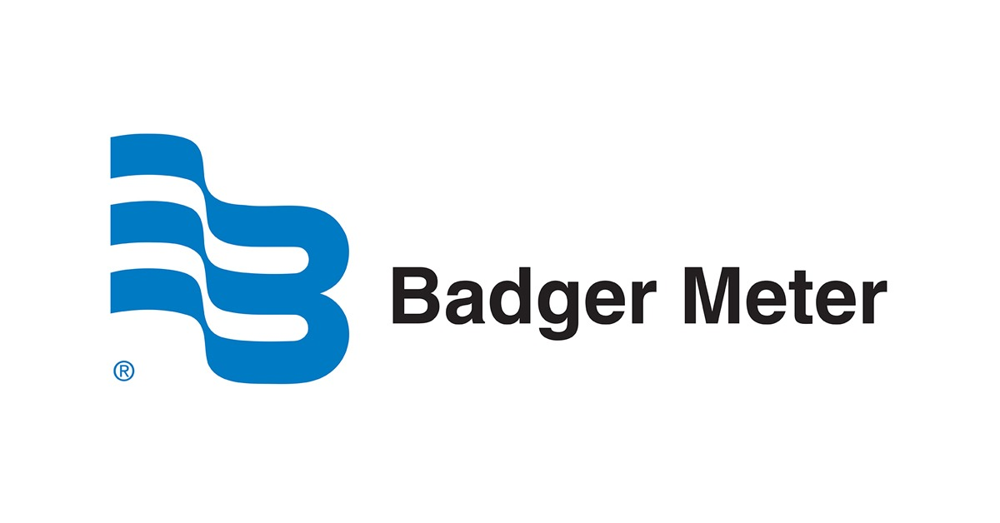

# Capítulo II: Requirements Elicitation & Analysis

## 2.1. Competidores.

En esta sección, se presenta un análisis de los competidores de Qlic y sus respectivas estrategias y tácticas. Se incluye un análisis competitivo, así como una comparación de las fortalezas y debilidades de cada competidor.

### 2.1.1. Análisis competitivo.

# Competitive Analysis Landscape

| Categoría / Empresa | Badger Meter | OptiRTC | Itron | Qlic |
|---------------------|--------------|---------|-------|------|
|  | |  |  |  |
| **Overview** | Ofrece soluciones inteligentes de gestión del agua a través de su suite **BlueEdge™**, que combina hardware de medición, comunicación confiable, software de análisis y soporte especializado. Permite monitorear el consumo en tiempo real, optimizar operaciones y reducir costos promoviendo la sostenibilidad. | Desarrolla soluciones de control adaptativo de aguas pluviales basadas en IoT, pronósticos climáticos y monitoreo en tiempo real. Ayuda a prevenir inundaciones, reducir descargas contaminantes, reutilizar agua y mejorar la resiliencia urbana. | Transforma la gestión de energía, agua y servicios urbanos con soluciones de infraestructura inteligente que integran dispositivos, datos y análisis. Busca mejorar la eficiencia y sostenibilidad de ciudades y utilities. | Empresa emergente que ofrece soluciones innovadoras para la gestión eficiente de recursos hídricos mediante tecnología digital accesible, ayudando a locales e instituciones a optimizar el uso del agua y reducir costos. |
| **Ventaja Competitiva** | Medición inteligente y análisis en tiempo real para optimizar consumo de agua y reducir costos operativos. | Control adaptativo de aguas pluviales con IoT y pronósticos climáticos para prevenir inundaciones y reutilizar agua de forma eficiente. | Integración de energía, agua y servicios urbanos mediante infraestructura inteligente que aumenta la eficiencia y sostenibilidad. | Soluciones digitales accesibles para gestionar el agua de forma eficiente y sostenible mediante dispositivos IoT. |
| **Mercado Objetivo** | Utilities de agua, municipios e industrias que requieren monitoreo inteligente y soluciones IoT para optimizar costos y eficiencia. | Ciudades, gobiernos locales y organizaciones ambientales que necesitan gestionar aguas pluviales y reducir inundaciones. | Utilities de energía y agua, además de ciudades inteligentes que buscan modernizar servicios urbanos. | Instituciones y locales que necesitan herramientas digitales accesibles para mejorar la gestión del agua y reducir costos. |
| **Estrategias de Marketing** | Publicidad en medios especializados, participación en ferias de agua y energía, SEO y generación de informes técnicos. | Campañas educativas sobre resiliencia urbana, casos de estudio con ciudades, SEO y presencia en conferencias ambientales. | Marketing basado en innovación y sostenibilidad, Google Ads, SEO, eventos internacionales de smart cities y alianzas estratégicas. | Uso activo de redes sociales, landing pages enfocadas en ahorro de costos, SEO y campañas digitales dirigidas a comunidades locales. |
| **Productos y Servicios** | Software de control adaptativo de aguas pluviales, monitoreo en tiempo real con IoT, gestión de infraestructuras urbanas para reutilización y reducción de riesgos de inundación. | Campañas educativas, estudios de caso con ciudades, posicionamiento en buscadores y conferencias ambientales. | Infraestructura inteligente para agua, energía y servicios urbanos, sensores conectados y plataformas de análisis con edge intelligence. | Aplicación digital para gestión del consumo de agua, herramientas accesibles de monitoreo y reducción de costos. |
| **Precios y Costos** | Venta de hardware IoT, costos de implementación y mantenimiento, servicios ligados a BlueEdge™. | Modelo de software como servicio con planes de suscripción según tamaño y necesidades. | Venta de dispositivos e infraestructura inteligente, contratos a gran escala con costos de implementación y soporte. | SaaS con planes mensuales o anuales accesibles. |
| **Canales de Distribución** | Plataforma web y apps móviles integradas con su sistema de monitoreo. | Plataforma web en la nube accesible desde navegadores y móviles. | Plataforma web con integración móvil para monitoreo y gestión en tiempo real. | Aplicación web y móvil para gestión y visualización de datos. |
| **Fortalezas (SWOT)** | Trayectoria y confianza en el mercado, soluciones integradas de hardware, software y soporte. | Especialización en infraestructura pluvial inteligente con tecnología predictiva. | Escala global y portafolio diversificado en energía, agua y smart cities. | Simplicidad y accesibilidad en soluciones digitales para gestión del agua. |
| **Debilidades (SWOT)** | Altos costos de implementación inicial. | Mercado nicho y limitado a gestión de tormentas. | Complejidad en la integración de múltiples servicios. | Startup en etapa temprana con recursos limitados frente a competidores. |
| **Oportunidades (SWOT)** | Mayor demanda de gestión inteligente del agua y sostenibilidad. | Aumento de inversión en infraestructura resiliente frente al cambio climático. | Crecimiento de smart cities y digitalización de utilities. | Conciencia creciente sobre ahorro de costos y sostenibilidad hídrica en negocios. |
| **Amenazas (SWOT)** | Competencia de nuevas startups con soluciones más accesibles. | Regulaciones cambiantes y presión por diversificación de servicios. | Competidores más especializados en sectores concretos. | Entrada de empresas consolidadas con productos similares. |

#### 2.1.2. Estrategias y tácticas frente a competidores

Desarrollar estrategias y tácticas efectivas para enfrentar a nuestros competidores requiere de un enfoque cuidadoso y planificado. A continuación se presentan algunas estrategias y tácticas que podrían ser consideradas para tener una ventaja competitiva frente a otras alternativas:

- Diferenciación por accesibilidad y costos
  Qlic puede destacar ofreciendo precios más bajos y planes flexibles que se adapten a negocios pequeños y medianos, aplicando paquetes escalables con suscripción mensual accesible
- Cercanía con el cliente
  La ventaja competitiva se fortalece al posicionarse como una solución fácil de usar y centrada en el cliente, brindando soporte personalizado y rápido, acompañado de tutoriales interactivos y webinars que aseguren la adopción y fidelización.
- Innovación tecnológica enfocada
  Qlic puede diferenciarse al ofrecer una solución web y móvil simple que muestre en tiempo real el consumo de agua, mediante un dashboard con métricas claras, alertas y recomendaciones prácticas, evitando la complejidad de los competidores grandes.

### 2.2. Entrevistas

#### 2.2.1. Diseño de entrevistas

A continuación, se presentan las preguntas para las entrevistas para ambos segmentos objetivo.

### Segmento 1: PYMES (negocios pequeños y medianos)

Preguntas:
- ¿Cómo controlan actualmente el consumo de agua en su negocio?
- ¿Qué problemas han tenido relacionados al desperdicio o fugas de agua?
- ¿Con qué frecuencia revisan los medidores o registros de consumo?
- ¿Consideran que el consumo de agua afecta de forma importante sus costos operativos?
- ¿Qué tan útil sería contar con reportes semanales o mensuales del consumo?
- ¿Qué opinan de recibir alertas en tiempo real sobre fugas o consumos inusuales?
- ¿Qué características esperan en una aplicación que les ayude a optimizar el uso de agua?
- ¿Estarían dispuestos a pagar una suscripción mensual/anual si con ello reducen costos y mejoran la gestión del agua?

### Segmento 2: Hogares y familias

Preguntas:
- ¿Cómo controlan el consumo de agua en su hogar actualmente?
- ¿Han tenido problemas con medidores defectuosos o cobros inesperados en sus recibos de agua?
- ¿Cómo suelen identificar fugas en casa?
- ¿Qué medidas aplican en el día a día para ahorrar agua?
- ¿Qué tan útil sería para ustedes recibir alertas en el celular sobre consumos excesivos o fugas?
- ¿Preferirían un plan básico con funciones esenciales o uno más avanzado con reportes detallados?
- ¿Qué tan importante consideran que es el ahorro de agua en la economía familiar?
- ¿Qué esperan de una aplicación que ayude a gestionar el consumo de agua en el hogar?

---
#### 2.2.2. Registro de entrevistas

En esta sección se aborda la información recolectada de cada entrevista incluyendo un resumen de las respuestas de los entrevistados.

## Segmento objetivo #1: PYMES (negocios pequeños y medianos)

### Entrevista 1

- **Nombres y apellidos:** Raul Quintana
- **Edad:** 29
- **Distrito:** Surco
- **Dispositivos:** iphone 15
- **Sucursales e influenciadores:** Empresa textil familiar en Lima, donde los padres (dueños) influyen directamente en la toma de decisiones sobre costos y consumo de agua
- **Tecnologia:** Dispositivos móviles Apple para gestión
- ***Navegador Preferido:** Chrome (antes Safari)

- **Duración de la Entrevista** 00:00 - 5:58
- **URL:** https://acortar.link/CHjPcJ
- **Resumen:** El entrevistado señaló que en su empresa textil controlan el consumo de agua de forma manual, leyendo el medidor al inicio y fin de mes. Han tenido problemas con fugas internas y desperdicio en procesos de limpieza y baños. Aunque el agua no es el mayor gasto, sí impacta cuando hay pérdidas. Considera útil una app con alertas semanales y de fácil uso, especialmente para que sus padres también la puedan manejar. Usa iPhone e iPad, con navegador Chrome.
---
### Entrevista 2

- **Nombres y apellidos:** Julio Gomez
- **Edad:** 34
- **Distrito:** Chorillos
- **Dispositivos:** Laptops personales (principalmente Mac)
- **Sucursales e influenciadores:** Florería en Lima; el entrevistado, como administrador, influye directamente en la gestión de recursos y toma de decisiones para reducir costos operativos.
- **Tecnologia:** Computadoras Mac y laptops para la gestión del negocio, con acceso a sistemas virtuales vía navegador
- ***Navegador Preferido:** Google Chrome

- **Duración de la Entrevista** 5:58 - 11:18
- **URL:** https://acortar.link/CHjPcJ
- **Resumen:** El entrevistado administra una florería y mencionó que actualmente controlan el consumo de agua revisando el recibo mensual, sin un medidor por áreas. Han tenido problemas con fugas en mangueras, goteros y riego excesivo por descuidos. Señaló que el agua es uno de los costos principales, especialmente en verano, cuando puede incrementarse hasta en un 25%. Considera muy útil contar con reportes semanales y alertas en tiempo real para detectar fugas. Espera que una aplicación sea simple, fácil de usar por el personal, y que permita separar el consumo por áreas e incluso planificar el riego según el clima. Estaría dispuesto a pagar una suscripción siempre que el costo sea menor al impacto económico de las fugas y desperdicios.
---
### Entrevista 3

- **Nombres y apellidos:** Bandit Gustafson
- **Edad:** 42
- **Distrito:** San Borja
- **Dispositivos:** Samsung Galaxy S22, Laptop Lenovo ThinkPad
- **Sucursales e influenciadores:** Restaurante de parrillas de ahumados *“Deoxa Parrillas”*, negocio propio; la toma de decisiones depende directamente del entrevistado.
- **Tecnología:** Uso básico de medidor físico, facturación mensual de la empresa de agua y laptop para gestión administrativa.
- **Navegador preferido:** Chrome

- **Duración de la Entrevista** 11:18 - 15:00
- **URL:** https://acortar.link/CHjPcJ

- **Resumen:** El entrevistado, dueño de un restaurante de parrillas, indicó que actualmente no lleva un control riguroso del consumo de agua, limitándose a revisar el recibo mensual. Mencionó un incidente con una fuga de más de 12 horas que incrementó drásticamente sus costos. Revisa el medidor ocasionalmente, una vez por semana o solo cuando percibe algún problema. Considera que el agua es un gasto alto en su ciudad y que afecta significativamente sus costos operativos. Le resultaría útil recibir reportes semanales y especialmente alertas en tiempo real para detectar fugas o consumos inusuales. Prefiere que la aplicación sea simple y fácil de usar, sin complicaciones. Está dispuesto a pagar una suscripción mensual o anual siempre que la solución le ayude a reducir costos de manera efectiva.

## Segmento objetivo #2: Hogares y familias

### Entrevista 1

- **Nombres y apellidos:** Piero Tenerio
- **Edad:** 20
- **Distrito:** San Juan de Miraflores
- **Dispositivos:** Samsung Galaxy A54
- **Sucursales e influenciadores:** Productos de consumo básico, recomendaciones de amigos y familiares
- **Tecnologia:** Dell Inspiron
- ***Navegador Preferido:** Edge y Chrome

- **Duración de la Entrevista** 15:00 - 18:17
- **URL:** https://acortar.link/CHjPcJ
- **Resumen:** El entrevistado comentó que controla el consumo principalmente revisando el recibo mensual. Ha tenido problemas con medidores defectuosos que generaron cobros excesivos. Identifica fugas cuando escucha goteos o nota movimiento en el medidor. Para ahorrar agua, reutiliza la de la lavadora y cierra llaves al cepillarse. Considera muy útil recibir alertas en el celular y estaría dispuesto a usar un plan básico o avanzado según el costo. Resaltó la importancia del ahorro en la economía familiar y espera que la aplicación sea sencilla, con alertas claras y reportes fáciles de entender.
---
### Entrevista 2

- **Nombres y apellidos:** Marco cotrina
- **Edad:** 22
- **Distrito:** Independencia
- **Dispositivos:** Xiaomi Redmi Note 11
- **Sucursales e influenciadores:** Marcas tecnológicas internacionales, tendencias de sostenibilidad
- **Tecnologia:** HP Pavilion
- ***Navegador Preferido:** Chrome

- **Duración de la Entrevista** 18:17 - 21:17
- **URL:** https://acortar.link/CHjPcJ
- **Resumen:** El entrevistado revisa ocasionalmente el medidor y promueve duchas cortas y uso responsable en casa. Ha tenido problemas de cobros inesperados y reclamó ante Sedapal. Detecta fugas por manchas de humedad o goteos. Entre sus medidas de ahorro, reutiliza agua de enjuague de ropa y usa recipientes en la cocina. Considera muy útil recibir alertas en el celular y prefiere un plan av
---
### Entrevista 3

- **Nombres y apellidos:** Angie Apaza
- **Edad:** 22
- **Distrito:** Breña
- **Dispositivos:** iphone 13
- **Sucursales e influenciadores:** Marcas ecofriendly, contenido en Instagram
- **Tecnologia:** lenovo
- ***Navegador Preferido:** Opera
-

- **Duración de la Entrevista** 21:17 - 25:35
- **URL:** https://acortar.link/CHjPcJ
- **Resumen:** La entrevistada indicó que no lleva un control riguroso del consumo, solo revisa el recibo mensual. Ha enfrentado cobros inusuales por fallas en el medidor. Identifica fugas por goteos o humedad en paredes. Sus medidas de ahorro incluyen cerrar la ducha mientras se enjabona y la llave al cepillar
---

#### 2.2.3. Análisis de entrevistas

## Hallazgos para el Segmento #1: PYMES (negocios pequeños y medianos)

### Hallazgos

- Los entrevistados controlan el consumo de agua de manera **manual**, ya sea revisando recibos o medidores.
- Han experimentado problemas con **fugas, riego excesivo o descuidos** que generan sobrecostos.
- Consideran útil una **app que brinde reportes semanales y alertas en tiempo real** para detectar fugas.
- Valoran la **simplicidad de uso**, de modo que tanto dueños como personal puedan manejarla fácilmente.
- El **costo del agua**, aunque no siempre es el mayor gasto, se vuelve crítico cuando hay desperdicios.
- Están dispuestos a **pagar una suscripción** siempre que el ahorro supere el costo de la solución.

### Hypothesis Statement – Segmento #1

Las PYMES que enfrentan fugas y desperdicios de agua carecen de herramientas de monitoreo automatizado. Una aplicación sencilla que brinde reportes semanales y alertas en tiempo real permitiría reducir costos operativos, optimizar el uso del recurso y garantizar la sostenibilidad del negocio.

## Hallazgos para el segmento #2: Hogares y Familias

Basándonos en las entrevistas, hemos llevado a cabo un análisis en el que destacamos los puntos compartidos y tendencias comunes entre los usuarios.

### Hallazgos

- Todos los entrevistados revisan el **recibo de agua** como su principal forma de control del consumo, aunque reconocen que no siempre es suficiente para detectar problemas a tiempo.
- Los tres mencionaron haber tenido **experiencias negativas con medidores defectuosos o cobros inesperados**, lo que genera desconfianza y preocupación en la gestión del servicio.
- La identificación de fugas se realiza principalmente a través de **señales visibles o auditivas** (goteos, manchas de humedad, movimiento del medidor), lo que refleja la falta de herramientas preventivas en los hogares.
- Entre las medidas de ahorro más comunes destacan: **cerrar llaves al cepillarse o ducharse, reutilizar agua de la lavadora o de enjuagues, y usar recipientes** para optimizar el consumo.
- Existe consenso en que **recibir alertas en el celular** sería muy útil, ya que ayudaría a detectar fugas o consumos excesivos antes de que se reflejen en el recibo.
- Mientras algunos prefieren un **plan básico** por razones de simplicidad y costo, otros valoran un **plan avanzado** con estadísticas y reportes detallados. Esto indica que el mercado presenta distintos perfiles de usuarios, desde los que buscan soluciones prácticas hasta los más interesados en datos y control.
- El **ahorro de agua** es visto como un tema muy importante para la economía familiar, pero también algunos lo asocian a la **sostenibilidad y cuidado del medio ambiente**.
- Todos coinciden en que esperan que la aplicación sea **sencilla de usar, brinde reportes claros y emita alertas rápidas y confiables** sobre consumos irregulares o fugas.

### 2.3. Needfinding

Esta sección presenta los resultados del proceso de análisis de la información recolectada sobre los usuarios y sus necesidades. Se incluyen artefactos clave como las User Personas, que representan perfiles de usuarios típicos; la User Task Matrix, que organiza las tareas según su importancia y frecuencia; los User Journey Maps, que trazan la experiencia del usuario; el Empathy Mapping, que profundiza en sus emociones y motivaciones; y el As-Is Scenario Mapping, que describe cómo los usuarios actualmente enfrentan sus problemas. Estos elementos permiten comprender mejor el contexto del usuario y fundamentar decisiones de diseño centradas en él.

#### 2.3.1. User Personas

En esta sección, se incluyen las fichas de User Personas que representan arquetipos detallados de los segmentos objetivo definidos para nuestro sitio web. Estos arquetipos se han creado a partir de un análisis de las entrevistas que hemos realizado con usuarios reales y un estudio comparativo de la competencia, con el objetivo de capturar las caracterí­sticas, necesidades, y comportamientos de nuestros usuarios.

- Hogares y familias

- Pequeñas y medianas empresas (PYMES)

#### 2.3.2. User Task Matrix

La User Task Matrix ayuda a priorizar y organizar las tareas clave que los usuarios realizan en QLic, enfocando el desarrollo en lo que genera más valor para ellos y para el negocio.

Segmentos de usuarios:

Hogares y familias: Control básico y ahorro de agua en el hogar.

PYMES: Monitoreo avanzado, eficiencia y reportes para decisiones.

| Tarea/Persona                               | Maria Fernanda Rojas - Frecuencia | Maria Fernanda Rojas - Importancia | Jorge Luis Caceres - Frecuencia | Jorge Luis Caceres - Importancia |
|---------------------------------------------|-----------------------------------|------------------------------------|---------------------------------|----------------------------------|
| Monitorear consumo de agua en tiempo real   | Alta                              | Alta                               | Alta                            | Alta                             |
| Recibir alertas de fugas o consumo excesivo | Media                             | Alta                               | Alta                            | Alta                             |
| Revisar reportes de consumo                 | Media                             | Media                              | Alta                            | Alta                             |
| Analizar recomendaciones para optimizar uso | Media                             | Alta                               | Media                           | Alta                             |
| Configurar dispositivos IoT                 | Baja                              | Media                              | Media                           | Alta                             |
| Monitorear niveles de agua en tanques       | Baja                              | Media                              | Alta                            | Alta                             |
| Contactar soporte técnico                                           | Media                             | Media                              | Media                           | Alta                             |
| Gestionar la suscripción                | Media                             | Media                              | Media                           | Media                            |
| Compartir datos o reportes con otros miembros                | Baja                              | Baja                               | Media                           | Media                            |

#### 2.3.3. User Journey Mapping

En esta sección se desarrollan los User Journey Maps de nuestros segmentos principales, representados por las User Personas María Fernanda Rojas (Usuario Residencial)
y Jorge Luis Cáceres (PYMES).

El objetivo es entender sus metas, procesos, puntos de fricción, emociones y oportunidades, para así diseñar una solución que responda a sus necesidades reales y genere valor.

Cada journey map describe el recorrido de principio a fin, desde la detección de una necesidad o problema relacionado con el uso de agua, hasta las acciones que actualmente realiza para resolverlo, identificando las brechas y dificultades que enfrentan en el camino.

- PYMES

Este User Journey Map muestra la experiencia de Jorge Luis Caceres, administrador de una florería, en la adopción de Qlic. Inicia con frustración por la falta de control y visibilidad del consumo de agua, pasa por dudas en la evaluación y configuración, y finaliza con satisfacción al optimizar costos y planificar el riego eficientemente. Los puntos de contacto incluyen Google, la app web y móvil, notificaciones y reportes, reflejando una transición positiva gracias a la facilidad de uso y beneficios tangibles.

- Hogares y familias

Este User Journey Map muestra la experiencia de María Fernanda Rojas, usuaria residencial, en la adopción de Qlic para controlar su consumo de agua. Comienza con frustración por la falta de información clara, pasa por indecisión ante múltiples opciones y desafíos en la instalación, y finaliza con satisfacción al optimizar su consumo y reducir gastos.

Los puntos de contacto incluyen redes sociales, la app Qlic, notificaciones y reportes, reflejando una transición emocional positiva impulsada por la facilidad de uso, datos claros y hábitos de consumo más eficientes.

#### 2.3.4. Empathy Mapping

Para los Empathy Mapping, utilizaremos a las User Personas María Fernanda Rojas, usuaria residencial que busca optimizar el consumo de agua en su hogar, y Jorge Luis Cáceres, gerente de operaciones de una PYMES que desea controlar y optimizar el uso de agua en su negocio, con el fin de comprender mejor sus motivaciones, frustraciones y necesidades para diseñar funcionalidades de QLic que les generen valor.

- Hogares y familias

Este empathy map describe a Maria Fernanda, una usuaria doméstica comprometida con el uso responsable del agua. Se siente frustrada por no poder controlar su consumo de manera efectiva y por recibir facturas elevadas sin entender claramente el origen de los gastos. Escucha consejos de amigos y medios sobre cómo ahorrar agua, y busca activamente dispositivos y aplicaciones que le ayuden a monitorear su consumo. Sin embargo, encuentra fricciones al usar algunas herramientas digitales y siente que la información disponible no siempre es clara. Maria desea soluciones que le permitan ahorrar agua, reducir sus costos y tener tranquilidad al saber que está contribuyendo al cuidado del medio ambiente. Valora especialmente aquellas tecnologías que sean fáciles de usar y que le brinden información precisa y útil.

- Pequeñas y medianas empresas (PYMES)

Este empathy map describe a Jorge, un Project Manager y Scrum Master que enfrenta constantes desafíos para coordinar equipos y gestionar proyectos con recursos limitados. Se siente frustrado por la falta de visibilidad sobre los puntos críticos del proceso y por no tener control suficiente sobre el uso de recursos. Vive rodeado de sugerencias y recomendaciones de distintas áreas que buscan mejorar la eficiencia, pero la información desorganizada y la dificultad para identificar problemas lo mantienen en un estado de incertidumbre. Jorge busca herramientas que le permitan tomar decisiones más informadas, reducir el desperdicio y aumentar la productividad. Está abierto a soluciones tecnológicas que le ofrezcan claridad, control y eficiencia sin requerir una curva de aprendizaje elevada.

#### 2.3.5. As-is Scenario Mapping

Para los As-Is Scenario, es una herramienta que nos ayuda a ejemplificar de mejor manera cual es el escenario actual sobre el problema que se intentará resolver, en este caso revisar el estado de las mesas, inventerio de ingredientes, asignar tareas al personal, y al momento de completar dichas tareas, comunicar su estado al supervisor.

- Hogares y familias: El escenario actual refleja las principales dificultades que enfrentan los usuarios residenciales en la gestión de su consumo de agua. El monitoreo se realiza de forma reactiva, ya que solo se revisa el medidor o el recibo una vez que llega, lo que genera incertidumbre y ansiedad por no tener control en tiempo real. La detección de problemas como fugas suele ocurrir tarde, cuando el daño ya está hecho y el gasto elevado. El proceso de reporte es lento y presencial, lo que implica pérdida de tiempo y estrés. Los pagos se realizan en efectivo y fuera del hogar, generando incomodidad y fricción. Finalmente, aunque existe motivación por ahorrar, los usuarios carecen de herramientas claras y accesibles para optimizar su consumo. Este mapeo evidencia la necesidad de soluciones digitales que permitan monitoreo proactivo, comunicación eficiente y gestión automatizada para mejorar la experiencia del usuario y fomentar el uso responsable del recurso.

- PYMES: Este mapeo revela cómo los responsables del consumo y gestión de recursos en pequeñas y medianas empresas enfrentan procesos fragmentados, manuales y poco confiables que dificultan la toma de decisiones operativas. El monitoreo del consumo se realiza de forma reactiva, revisando medidores o esperando el recibo, sin una visión integral por áreas. Los problemas como fugas solo se detectan cuando el costo del recibo es elevado, generando estrés y pérdidas en la producción. La comunicación de incidencias se hace por correo o llamada, dependiendo de la urgencia, lo que provoca impaciencia ante respuestas lentas. Los pagos se gestionan manualmente, lo que genera preocupación por errores y recargos. Finalmente, los intentos de optimización se basan en hojas de cálculo con datos incompletos, lo que frustra la identificación de oportunidades de ahorro. Las emociones predominantes son la preocupación, el estrés y la frustración, lo que evidencia una clara oportunidad para implementar soluciones digitales que integren monitoreo, comunicación y análisis en tiempo real.

### 2.4. Ubiquitous Language
A continuación, se presenta un glosario de términos clave del dominio que serán utilizados en el desarrollo de la plataforma Qlic,
orientada a la gestión inteligente del agua en hogares y negocios. Los términos están en inglés, con su equivalente en español entre paréntesis,
acompañados de una definición clara en español.

- Water Consumption (Consumo de agua):
  Cantidad total de agua utilizada en un hogar o negocio en un periodo determinado.

- Water Waste (Desperdicio de agua):
  Agua utilizada de manera ineficiente o perdida por fugas, goteos o malos hábitos de uso.

- Critical Point (Punto crítico):
  Zona, dispositivo o instalación donde es necesario realizar un monitoreo constante del uso de agua para evitar pérdidas o exceso de consumo.

- Real-Time Monitoring (Monitoreo en tiempo real):
  Seguimiento instantáneo del consumo de agua y estado de los dispositivos a través de sensores IoT conectados a la plataforma.

- Water Optimization (Optimización del agua):
  Conjunto de acciones y recomendaciones destinadas a mejorar la eficiencia en el uso del recurso, reduciendo costos y evitando desperdicios.

- Water Replenishment (Reabastecimiento de agua):
  Acción de garantizar que siempre exista agua disponible en los puntos críticos de consumo mediante alertas o sistemas automáticos.

- Consumption Report (Reporte de consumo):
  Documento digital generado por la plataforma que muestra métricas de uso de agua, tendencias y recomendaciones de mejora.

- Water Cost Reduction (Reducción de costos de agua):
  Beneficio directo de la optimización, al disminuir los gastos en la factura del servicio de agua gracias a un consumo más eficiente.

- Sustainability (Sostenibilidad):
  Principio de garantizar el uso responsable del agua para contribuir a la preservación del medio ambiente y a la eficiencia de los recursos.