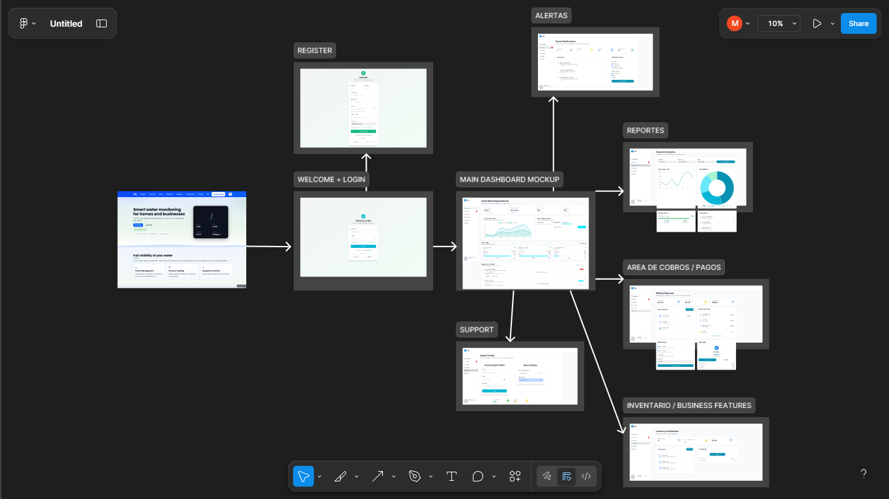

# Capítulo IV: Product Design

## 4.1. Style Guidelines
En esta sección, se presentan las pautas de estilo y diseño que guiarán la creación de la página web y la aplicación de Qlic. Estas pautas buscan asegurar una experiencia de usuario coherente, clara y atractiva, transmitiendo confianza y accesibilidad, en línea con la identidad de la marca y los objetivos del proyecto.

### 4.1.1. General Style Guidelines

**Tono de Comunicación:**
- Confiable y profesional, para transmitir seguridad y respaldo a los usuarios
- Cercano y empático, para generar confianza en la comunidad
- Claro y directo, evitando tecnicismos que dificulten la comprensión
- Enfocado en beneficios tangibles para homes y businesses en el monitoreo de agua

**Tipografía:**
- **Poppins:** Para títulos y encabezados. Moderna, limpia y fácil de leer
- **Roboto:** Para párrafos y textos largos. Muy legible en web y móvil
- Jerarquía tipográfica clara con tamaños contrastantes entre títulos y contenido

**Colores de Marca:**
- **Primario:** Azul vibrante (#0C4AFD) – Color principal para navegación, header y elementos destacados
- **Secundario:** Azul oscuro – Para elementos de contraste, títulos y texto principal
- **Accento azul:** Azul medio (#3b82f6) – Para la mayoría de botones CTA como "Get Started", "Choose Plan"
- **Accento verde:** Verde (#22c55e) – Uso específico para el botón "Send" del formulario de contacto
- **Neutro oscuro:** Gris oscuro/negro – Para textos principales y títulos de sección
- **Neutro claro:** Gris medio – Para textos secundarios y descripciones
- **Fondo:** Gradientes suaves y fondos claros – Para secciones de transición
- **Fondo principal:** Blanco y verde o celeste muy claro – Para contenido general

**Paleta de Colores:**

| Color             | Código Hex        | Uso Principal |
|-------------------|-------------------|---------------|
| Azul Principal    | #0C4AFD           | Header, navegación, elementos brand |
| Azul CTA          | #0C4AFD           | Botones principales: "Get Started", "Choose Plan", CTAs generales |
| Verde Específico  | #22c55e           | Botón "Send" del formulario únicamente |
| Azul Recomendado  | #22c55e           | Badge "Recommended" en plan Pro |
| Gris Oscuro/Negro | #0F0F0F           | Textos principales y títulos de sección |
| Gris Medio        | #6b7280           | Textos secundarios y descripciones |
| Fondo Claro       | #ffffff / #E8FFEE | Fondo general, cards, limpieza visual |

**Spacing y Layout:**
- Espacios amplios entre secciones para evitar saturación
- Márgenes y paddings consistentes para mantener jerarquía visual
- Uso de cards con esquinas redondeadas (8-12px) y sombras suaves
- Diseños con jerarquía clara: título > subtítulo > contenido
- Layout centrado con máximo ancho para legibilidad óptima

### 4.1.2. Web Style Guidelines

Desarrollaremos una plataforma digital que pueda usarse en cualquier dispositivo tecnológico, manteniendo el mismo diseño y estructura, para eso debemos tener en cuenta las cualidades de cada dispositivo para poder mantener un buen orden y diseño para todos los dispositivos.

**Responsive Design:**
- La página es completamente adaptable a dispositivos móviles, tablets y desktops
- Navegación hamburger para dispositivos móviles
- Layouts flexibles que se adaptan a diferentes tamaños de pantalla

**Componentes Implementados:**

**Header:**
- Logo Qlic prominente en la esquina izquierda
- Navegación horizontal con: Product, About Us, Team, Solutions, Features, Pricing, FAQ
- Botón CTA "Contact Sales" destacado con fondo blanco
- Selector de idioma (EN) en la esquina derecha

**Hero Section:**
- Título principal impactante: "Smart water monitoring for homes and businesses"
- Descripción clara del valor: "Track water volume, pressure, density and temperature in real time with clear alerts and reports"
- Botones duales: "Get Started" (azul primario) y "Learn More" (secundario transparente)
- Badge destacado "Real-Time Water Monitoring" en verde claro
- Métricas de confianza horizontales: "Certified water sensors • 99.9% uptime • Cloud dashboard"
- Dashboard visual oscuro del producto mostrando métricas de agua en tiempo real:
  - Volume: 1,250 L
  - Pressure: 2.4 bar
  - Temperature: 12.6 °C
  - Density: 0.98 g/cm³

**Secciones de Contenido:**

**Full visibility of your water:** Descripción + tres cards con iconos azules:
- Water Volume Management: "Record water levels, calculate consumption and predict refills"
- Water Pressure Tracking: "Detect pressure variations to prevent water line damage"
- Water Temperature Control: "Ensure ideal water temperature ranges with smart alerts"

**About Us:**
- Descripción: "At Qlic we build sensor and software technology to provide total visibility of water usage. We believe in precise data, useful alerts and operational simplicity for water management"
- Tres pilares con iconos rojos/amarillos/azules: Mission, Reliability, Customer focus
- Imagen del dashboard a la derecha

**Our team:** "Five pillars powering Qlic: engineering, hardware, data, product and operations"
- Cinco avatars circulares con iniciales: AB, PG, ML, JY, AA
- Nombres completos debajo de cada avatar

**Solutions by segment:** Dos cards principales:
- Residences: "Monitor water tanks, receive low-level alerts and prevent water leaks"
- Businesses: "Control water inventories, usage audits and compliance for water management"

**Key features:** Tres cards con descripciones técnicas:
- Water Pressure Tracking: "Water pressure trends and safety thresholds with notifications"
- Water Temperature Control: "Custom water temperature ranges and thermal control for quality"
- Water Volume Management: "Water consumption projections and refill logistics"

**Subscription plans:** Tres columnas con precios y características:
- Basic $19/mo: 1 water tank, update every 15 min, basic water alerts, email support
- Pro $49/mo (Recommended): Up to 5 water tanks, update every 5 min, advanced water alerts, shared dashboards, priority support
- Enterprise Custom: Unlimited water tanks and sites, integrations and SLAs, water usage exports and audits, 24/7 support

**What our customers say:** Sección de testimonios con tres cards de clientes:
- **Laura P. (Facilities Lead):** "We finally have full visibility of our water tanks. Alerts prevented two outages last month." - 5 estrellas
- **Daniel R. (Operations Manager):** "Setup was simple and the dashboards are clear. Great support as well." - 5 estrellas
- **María G. (Plant Supervisor):** "We reduced water waste by 18% after a quarter using Qlic." - 5 estrellas
- Subtítulo: "Real stories from teams using Qlic for water"
- Avatars circulares con iniciales en colores distintivos (LP, DR, MG)
- Diseño de cards con bordes suaves y rating de estrellas prominente

**FAQ:** Sección con preguntas desplegables:
- "What water systems can I monitor?"
- "Do I need constant internet for water monitoring?"
- "How do water alerts work?"

**Contact Sales:**
- Descripción: "Tell us about your water management needs and a specialist will contact you"
- Formulario con campos: Name, Email, Message
- Botón "Send" en verde (único botón verde del sitio)

**Footer:**
- Estructura en cuatro columnas bien definidas:
  - **Company:** About Us, Our Services, Privacy Policy, Affiliate Institutions
  - **Get Help:** FAQ, Progress, Advisors, Payment Options
  - **Community:** Our Story, Developers, Events
  - **Follow Us:** Íconos de redes sociales (Facebook, Twitter, Instagram, YouTube)
- Copyright notice: "© 2025 Qlic. All rights reserved."
- Logo "Qlic" en la esquina inferior izquierda

**Interacciones:**
- Hover effects en botones con transiciones suaves
- Cards interactivas con sombras y efectos de hover
- Formularios con feedback visual inmediato
- Navegación suave entre secciones
- Responsive design con adaptabilidad completa

## 4.2. Information Architecture
La landing page se diseñó con un flujo lógico que guía al usuario desde el primer impacto visual hasta la acción final. La organización está pensada para usuarios tanto familiarizados como no familiarizados con la tecnología IoT de monitoreo de agua, priorizando simplicidad, claridad y conversión.

**Orden lógico de las secciones:**
1. **Hero:** Primer impacto visual con título, subtítulo y botones CTA duales
2. **Full visibility:** Descripción de las capacidades principales de monitoreo de agua
3. **About Us:** Presentación de la empresa con pilares de valor (Mission, Reliability, Customer focus)
4. **Our team:** Credibilidad a través del equipo técnico
5. **Solutions by segment:** Diferenciación clara entre Residences y Businesses para monitoreo de agua
6. **Key features:** Funcionalidades técnicas detalladas para agua
7. **Subscription plans:** Estructura de precios clara con tres opciones
8. **What our customers say:** Testimonios de clientes reales con casos de éxito en monitoreo de agua
9. **FAQ:** Resolución de dudas comunes sobre monitoreo de agua
10. **Contact Sales:** CTA final con formulario de contacto
11. **Footer:** Información secundaria, enlaces legales y redes sociales

### 4.2.1. Organization Systems
- **Jerárquico:** Se organiza de lo más importante (valor del producto de monitoreo de agua y CTA inicial) hacia lo más detallado (planes, FAQ, contacto)
- **Secuencial:** Sigue un recorrido natural: Qué es → Quién somos → Soluciones → Características → Precios → Contacto
- **Por audiencia:** Diferenciación clara entre segmentos residencial y empresarial para gestión de agua
- **Por funcionalidad:** Agrupación lógica de características técnicas de monitoreo de agua

### 4.2.2. Labeling Systems
Se emplean etiquetas claras, simples y orientadas al usuario para identificar cada sección.

**Etiquetas de navegación:**
- "Product"
- "About Us"
- "Team"
- "Solutions"
- "Features"
- "Pricing"
- "FAQ"
- "Contact Sales"

**Etiquetas de contenido:**
- "Smart water monitoring for homes and businesses"
- "Full visibility of your water"
- "Solutions by segment"
- "Key features"
- "Subscription plans"
- "What our customers say"
- "Frequently asked questions"

### 4.2.3. SEO Tags and Meta Tags

**Title:** Qlic – Smart Water Monitoring for Homes and Businesses

**Description:** Monitor water systems with IoT sensors. Track water volume, pressure, density and temperature in real time with clear alerts and reports for optimal water management.

**Keywords:** Smart water monitoring, water management, IoT water sensors, water tank monitoring, water pressure tracking, water temperature control, water volume management, real-time water alerts

**Meta Tags:**
- Viewport: width=device-width, initial-scale=1.0
- Charset: UTF-8
- Author: WASD Team
- Robots: index, follow
- Language: en-US, es-ES

### 4.2.4. Searching Systems

**Navegación por categorías:**
- La barra de navegación facilita acceso directo a todas las secciones principales
- Categorización clara entre información del producto, empresa, equipo y precios

**Búsqueda por contenido:**
- FAQ section para resolución rápida de dudas sobre monitoreo de agua
- Navegación anclada para acceso directo a secciones específicas
- Breadcrumbs visuales a través del scroll

### 4.2.5. Navigation Systems

**Barra de navegación principal:**
- Navegación horizontal sticky con acceso a todas las secciones
- Botón "Contact Sales" prominente como CTA principal

**Botones de llamada a la acción (CTA):**
- Hero section: "Get Started" (azul primario) y "Learn More" (outline secundario)
- Planes de suscripción: "Choose Plan" (outline azul) en Basic y Enterprise, "Choose Plan" (azul sólido) en Pro
- Formulario de contacto: "Send" (verde - único botón verde del sitio)
- Distribución estratégica de CTAs en azul excepto el envío de formulario

**Footer navigation:**
- Enlaces organizados por categorías: Company, Get Help, Community, Follow Us
- Acceso a información legal, soporte y redes sociales
- Copyright y información corporativa

**Elementos de confianza:**
- Métricas destacadas: "99.9% uptime", "Certified water sensors"
- Presentación completa del equipo técnico
- Testimonios reales de clientes con casos de éxito específicos
- Métricas de confiabilidad y resultados cuantificables

## 4.3. Landing Page UI Design

En esta sección se presenta la propuesta de diseño de interfaz de usuario para la Landing Page del producto. Se inicia con una introducción donde se explica cómo las decisiones de diseño visual y arquitectura de la información se traducen en una experiencia clara, atractiva y funcional para el usuario. La propuesta busca reflejar la identidad del producto, captar la atención de los visitantes y facilitar la comprensión de su valor desde el primer contacto.

### 4.3.1. Landing Page Wireframe

El wireframe de la página de inicio de Qlic organiza los elementos clave para
ofrecer una navegación intuitiva. Incluye un encabezado con el logo y un menú de
navegación, seguido de una propuesta de valor clara con botones de acción destacados
como "Contact Sales" y "Get Started?". La página cuenta con secciones que hablan sobre
el proyecto , las funcionalidades clave del sistema, nuestro quipo, planes de
suscripciones, testimonios de usuarios y otras pantallas informativas
. Al final, se encuentra un formulario de contacto para que los
usuarios se puedan contactar con nosotros, junto con enlaces legales
en el pie de página.

**Figura 1:** Wireframe de la Landing Page.

### 4.3.2. Landing Page Mock-up

La Landing Page Mock-up de Qlic muestra un diseño limpio y organizado,
con una estructura intuitiva que guía a los usuarios a través de la plataforma.
Incluye una propuesta de valor destacada en la parte superior, seguida de secciones
clave como las funcionalidades clave, los beneficios para empresas y hogares,
y una explicación clara de cómo funciona el servicio. También cuenta con testimonios de
clientes, detalles sobre la empresa y un formulario para contactar con el area de ventas
, todo con un enfoque en facilitar la conversión de visitantes a usuarios activos.

**Figura 2:** Mockup de la Landing Page.

## 4.4. Web Applications UX/UI Design
En esta sección, se presentan los wireframes y mock-ups de la aplicación web de Qlic. Así como también,
los wireflow y user flow diagrams. Estos diseños son esenciales para establecer la estructura y funcionalidad de la plataforma,
asegurando una experiencia de usuario intuitiva y eficiente.

### 4.4.1. Web Applications Wireframes
Los wireframes de la plataforma web Qlic muestran la estructura funcional pensada para ayudar a
propietarios y gestores a mantener un control eficiente sobre su agua con sensores inteligentes.

LOGIN WIREFRAME:

REGISTER WIREFRAME:

MAIN DASHBOARD WIREFRAME:

ALERTS WIREFRAME:

INVENTORY & FEATURES WIREFRAME:

SUPPORT WIREFRAME:

### 4.4.2. Web Applications Wireflow Diagrams

- **Usergoal 15,16,28** : Alertas de anomalías en consumo, Alertas de fallas IoT, Notificaciones configurables
  

- **Usergoal 8,9,10,27** : Ver preguntas frecuentes (FAQ), Contactar ventas, Visualizar informacion de los integrantes del equipo, Soporte técnico
  

- **Usergoal 20,21,22,23** : Historial de facturación, Proyección de consumo y costo, Comparación de consumo, Reportes personalizados
  

- **Usergoal 3,4,5,12,13,17,18,19,26** : Monitoreo en Tiempo Real, Seguimiento de presión, Control de temperatura, Monitoreo por habitación, Detección de patrones de uso, Recomendaciones personalizadas, Consejos de sostenibilidad, Metas de consumo, Integración de dispositivos IoT
  

- **Usergoal 6** : Gestión de volumen
  

- **Usergoal 7,29,30** : Ver y selección de planes de suscripción, Pago con tarjeta de crédito, Pago con billetera digital
  

- **Usergoal 11** : Acceder a la Web App desde la landing page
  

- **Usergoal 24,25** : Inventario de agua en tanques, Predicciones de reabastecimiento
  

### 4.4.2. Web Applications Mock-ups
- LOGIN MOCK-UP:
  

- REGISTER MOCK-UP:
  

- MAIN DASHBOARD MOCK-UP:
  

- ALERTS MOCK-UP:
  

- REPORTS MOCK-UP:
  

- BILLING MOCK-UP:
  

- INVENTORY & FEATURES MOCK-UP:
  

- SUPPORT MOCK-UP:
  

### 4.4.3. Web Applications User Flow Diagrams
- **Usergoal 15,16,28** : Alertas de anomalías en consumo, Alertas de fallas IoT, Notificaciones configurables
  

- **Usergoal 8,9,10,27** : Ver preguntas frecuentes (FAQ), Contactar ventas, Visualizar informacion de los integrantes del equipo, Soporte técnico
  

- **Usergoal 20,21,22,23** : Historial de facturación, Proyección de consumo y costo, Comparación de consumo, Reportes personalizados
  

- **Usergoal 3,4,5,12,13,17,18,19,26** : Monitoreo en Tiempo Real, Seguimiento de presión, Control de temperatura, Monitoreo por habitación, Detección de patrones de uso, Recomendaciones personalizadas, Consejos de sostenibilidad, Metas de consumo, Integración de dispositivos IoT
  

- **Usergoal 6** : Gestión de volumen
  

- **Usergoal 7,29,30** : Ver y selección de planes de suscripción, Pago con tarjeta de crédito, Pago con billetera digital
  

- **Usergoal 11** : Acceder a la Web App desde la landing page
  

- **Usergoal 24,25** : Inventario de agua en tanques, Predicciones de reabastecimiento
  

## 4.5. Web Applications Prototyping

En esta sección, se presentan los prototipos de la aplicación web de Qlic.
Estos prototipos son representaciones interactivas que permiten a los usuarios explorar y experimentar con
la interfaz antes de su desarrollo final. Proporcionan una visión clara de la navegación, la disposición de
los elementos y la funcionalidad general de la aplicación.

Punto de entrada: El flujo comienza con wireframes de registro Sign Up y LogIn,
estableciendo el sistema de autenticación como puerta de entrada. Se observa una estructura que combina:

Módulos principales:

Alertas - Gestión de alertas del sistema.
Dashboard - Vista general y métricas.
Reportes - Reporte analitico de uso del agua.
Pagos - Gestión de pagos del usuario.
Inventario - Gestión de tanques de agua.
Soporte - Soporte técnico de la app.

## 4.6. Domain-Driven Software Architecture

En esta sección se desarrolla la arquitectura
de software basada en el enfoque Domain-Driven
Design (DDD), centrada en modelar el dominio del
problema con precisión y alineación al negocio. Se
identifican los Bounded Contexts, las entidades, agregados,
servicios del dominio, repositorios y eventos relevantes,
promoviendo una separación clara de responsabilidades.
Esta arquitectura permite que el sistema evolucione de
forma coherente con las reglas del dominio, facilitando
la escalabilidad, el mantenimiento y la colaboración entre
equipos técnicos y expertos del negocio.

### 4.6.1. Design-Level Event Storming
### 4.6.2. Software Architecture Context Diagram

En el diagrama de contexto se presenta cómo los usuarios, que incluyen a los hogares/familias y pequeñas o medianas empresas, interactúan tanto con nuestro software.

### 4.6.3. Software Architecture Container Diagrams

A continuación, se presentará el diagrama de contenedores de nuestro sistema. Este artefacto corresponde al segundo nivel del modelo C4 y ofrece una descripción más detallada de los componentes técnicos, lo que proporciona una visión ampliada de la arquitectura del software.

### 4.6.4. Software Architecture Components Diagrams

A continuación, se mostrarán los diagramas de componentes para cada Bounded Context, junto con detalles sobre las tecnologías utilizadas e implementaciones específica.

- Profiles Component Diagram

- Reports Component Diagram

- Notifications Component Diagram

- Payments Component Diagram

- Subscriptions Component Diagram

- User Water Analytics Component Diagram

- Anomaly Detection Component Diagram

## 4.7. Software Object-Oriented Design

En esta sección se presenta el diseño orientado a objetos del software, donde se definen las clases, sus responsabilidades y relaciones, siguiendo principios fundamentales como la encapsulación, herencia, abstracción y polimorfismo. El diseño busca garantizar la modularidad, reutilización y mantenibilidad del sistema, apoyándose en patrones de diseño y buenas prácticas de modelado. Se incluyen diagramas (como diagramas de clases) que reflejan la estructura lógica del software y su alineación con los requerimientos funcionales.

### 4.7.1. Class Diagrams

## 4.8. Database Design

En esta sección se presenta el diseño de la base de datos que soporta el funcionamiento del sistema, alineado con los modelos del dominio y los requerimientos funcionales. Se definen las entidades, relaciones, claves primarias y foráneas, así como las restricciones necesarias para garantizar la integridad de los datos. El diseño busca eficiencia, escalabilidad y facilidad de mantenimiento, considerando tanto el modelo lógico como el modelo físico de la base de datos. Se incluyen diagramas (como el modelo entidad-relación) para representar visualmente la estructura y organización de los datos.

### 4.8.1. Database Diagrams

