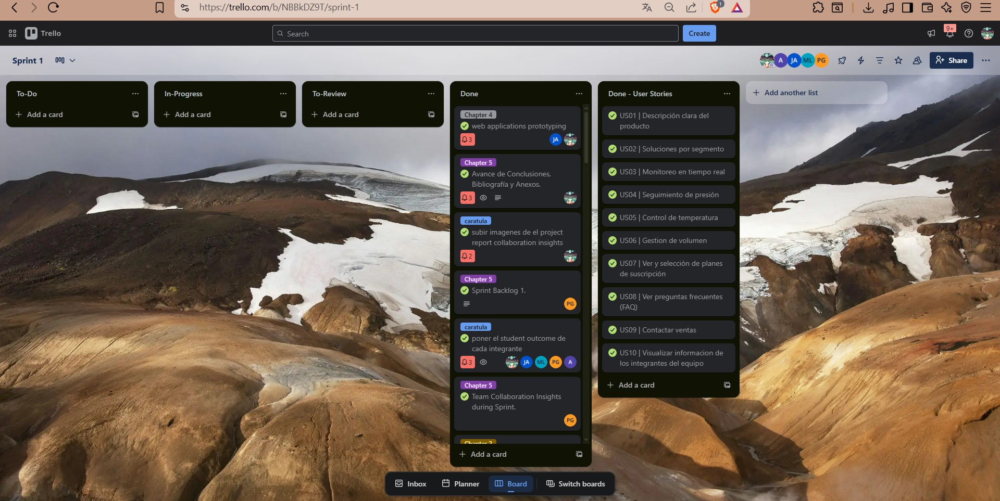

# Capítulo V: Product Implementation, Validation & Deployment

## 5.1. Software Configuration Management
### 5.1.1. Software Development Environment Configuration
En esta sección, se incluirá los productos de software que se usaron en el proyecto.

Se clasificará en el siguiente orden:
- Producto UX/UI Design.
- Software Development.
- Software Deployment.

**Producto UX/UI Design:** 
- [Figma](https://www.figma.com/) - Herramienta de diseño colaborativo para crear prototipos y maquetas de interfaces de usuario.
- [Lucidchart](https://lucid.app/) - Herramienta de diagramación para crear diagramas de flujo, wireframes y otros elementos visuales.
- [Uxpressia](https://uxpressia.com/) - Herramienta de diseño centrada en el usuario para crear mapas de empatía y customer journey maps.
- [Structurizr](https://structurizr.com/) - Herramienta de modelado de software para crear diagramas de arquitectura y diseño orientado a dominios.
- [Miro](https://miro.com/) - Plataforma de pizarra colaborativa en línea que permite a equipos trabajar juntos en tiempo real para crear mapas mentales, flujos de usuarios y planificaciones de producto.
- [Vertabelo](https://vertabelo.com/) - Herramienta de modelado de bases de datos que permite diseñar esquemas visuales, generar scripts SQL y colaborar en tiempo real con tu equipo.
- [Trello](https://trello.com/) - Herramienta visual de gestión de proyectos basada en tableros y tarjetas que facilita la organización, seguimiento y colaboración en tareas dentro de equipos de trabajo.

**Software Development:** 
- [IntelliJ IDEA](https://www.jetbrains.com/idea/) - Entorno de desarrollo integrado (IDE) para Java y otros lenguajes de programación.
- [Github](https://www.github.com/) - Plataforma de control de versiones y colaboración para el desarrollo de software.
- [Visual Studio Code](https://code.visualstudio.com/) - Editor de código fuente ligero y potente para varios lenguajes de programación.
- [HTML](https://www.w3.org/TR/html52/) - Lenguaje de marcado para la creación de páginas web.
- [CSS](https://www.w3.org/Style/CSS/) - Lenguaje de estilo para la presentación de documentos HTML.
- [CodeSandBox](https://codesandbox.io/) = Entorno de desarrollo en línea que permite crear, editar y desplegar rápidamente proyectos web, ideal para construir y probar landing pages de forma colaborativa y sin necesidad de configuración local.

**Software Deployment:** 
- GitHub Pages - Servicio de alojamiento web para proyectos estáticos.
- Vercel - Plataforma para desplegar aplicaciones web frontend, utilizada para el frontend de la aplicación.
- Railway - Plataforma para desplegar una fakeapi, utilizada para el fakeapi de la aplicación.

### 5.1.2. Source Code Management

Para la gestión del código fuente, se utilizará GitHub como plataforma central de control de versiones y colaboración entre los miembros del equipo. Se han creado repositorios separados para los distintos productos del proyecto.
Los enlaces también están disponibles en la sección de anexos.

- **Organización en GitHub:** [https://github.com/wasd25](https://github.com/wasd25)
- **Repositorio del informe:** [https://github.com/wasd25/final-report](https://github.com/wasd25/final-report)
- **Repositorio de la Landing Page:** [https://github.com/wasd25/landing-page](https://github.com/wasd25/landing-page)
- **Repositorio del frontend:** [https://github.com/wasd25/qlic-frontend](https://github.com/wasd25/qlic-frontend)
- **Repositorio de la fakeapi:** [https://github.com/wasd25/qlic-fakeapi](https://github.com/wasd25/qlic-fakeapi)

#### Modelo de ramificación: GitFlow

Para el modelo de desarrollo, se decidió usar GitFlow como modelo de ramificación. Este modelo permite una gestión eficiente de las ramas y facilita la colaboración entre los desarrolladores.

Para el repositorio del informe se crearon las siguientes ramas:
- **main:** Rama principal de desarrollo, donde se integrarán todas las características y correcciones de errores.
- **chapter-1:** Rama para el desarrollo del capítulo 1 del informe.
- **chapter-2:** Rama para el desarrollo del capítulo 2 del informe.
- **chapter-3:** Rama para el desarrollo del capítulo 3 del informe.
- **chapter-4:** Rama para el desarrollo del capítulo 4 del informe.
- **chapter-5:** Rama para el desarrollo del capítulo 5 del informe.

Para el repositorio de Landing Page se crearon las siguientes ramas:

- **main:** Rama principal del proyecto donde se integran todas las funcionalidades estables y correcciones finales.
- **feature/about-us:** Rama para el desarrollo de la sección "Acerca de nosotros".
- **feature/contact-sales:** Rama dedicada a implementar el formulario y la lógica de "Contacto con ventas".
- **feature/faq:** Rama para crear la sección de "Preguntas frecuentes" (FAQ).
- **feature/footer:** Rama para desarrollar el componente del pie de página global.
- **feature/header:** Rama para construir el encabezado de navegación principal.
- **feature/hero:** Rama para implementar la sección principal de presentación (hero section).
- **feature/product:** Rama para desarrollar la sección de presentación del producto.
- **feature/solutions:** Rama para crear la sección que detalla las soluciones ofrecidas.
- **feature/subscriptions:** Rama para implementar el sistema de suscripciones.

Para el repositorio de FrontEnd se crearon las siguientes ramas:

- **master:** Rama principal donde una vez concluida la programación de un bounded context se hace un merge a esta rama.
- **feature/anomaly-detection:** Rama donde se desarrolla el bounded context de anomaly-detection donde el usuario, puede visualizar los uso indebidos o descontrolados del agua en su hogar o local.
- **feature/notifications:** Rama donde se desarrolla el bounded context de notifications donde el usuario, recibe notificaciones personalizadas basadas en las preferencias que haya elegido.
- **feature/payments:** Rama donde se desarrolla el bounded context de payments donde el usuario, puede configurar su método de pago.
- **feature/profile:** Rama donde se desarrolla el bounded context de profile donde el usuario, puede personalizar a su gusto su perfil y cambiar su contraseña.
- **feature/reports:** Rama donde se desarrolla el bounded context de reports donde el usuario, descarga los reportes que desee y le muestra estadísticas y analíticas del uso de agua en su hogar o local.
- **feature/subscription:** Rama donde se desarrolla el bounded context de subscription donde el usuario, puede realizar el pago de su suscripción a la aplicación

#### Estilo de commits: Conventional Commits
Para asegurar mensajes de commits claros y estandarizados, se seguirá la convención [Conventional Commits](https://www.conventionalcommits.org/en/v1.0.0/). Algunos ejemplos:

- feat: add search by name functionality
- fix: correct form validation error
- docs: update installation instructions
- refactor: simplify calculation logic

El prefijo de categorías se define de la siguiente forma:
- feat: A new feature
- fix: A bug fix
- docs: Documentation only changes
- style: Changes that do not affect the meaning of the code (formatting, missing semicolons, etc.)
- refactor: A code change that neither fixes a bug nor adds a feature
- test: Adding missing tests or correcting existing ones
- chore: Changes to the build process or auxiliary tools

### 5.1.3. Source Code Style Guide & Conventions

En esta sección se definen las convenciones de nombres y codificación adoptadas por el equipo para los lenguajes utilizados en 
el proyecto: HTML, CSS, JavaScript, TypeScript y Java. El idioma estándar para todo el código (nombres de variables, funciones, clases, archivos, etc.) 
es el **inglés**.

#### Principios generales

- **Idioma estándar:** Todo el código fuente está escrito en inglés, incluyendo nombres de archivos, clases, variables y funciones.
- **Legibilidad ante todo:** Se prioriza el uso de nombres descriptivos y claros por encima de abreviaciones o tecnicismos innecesarios.
- **Formato consistente:** Se aplica un estilo uniforme en todo el equipo y en todos los lenguajes, reforzado por herramientas automáticas.
- **Nombres semánticos:** Se usan **sustantivos** para clases, componentes y archivos, y **verbos** para funciones o métodos.
- **Indentación:** 2 espacios para HTML, CSS, JS.

#### HTML y CSS

**HTML**
- Archivos terminan en `.html`.
- Se utilizan etiquetas semánticas como `<header>`, `<section>`, `<nav>`, `<footer>`, etc.
- Se incluye `alt` en imágenes y atributos `aria-*` para accesibilidad.
- Atributos con comillas dobles (`"`).
- Indentación: 2 espacios.

**CSS**
- Archivos terminan en `.css`.
- Los selectores y clases se nombran en minúsculas y guiones medios `.form-container`, `.btn-enviar`.
- Se agrupan estilos relacionados y se separan con comentarios.
- Se define una paleta de colores base en variables CSS para mantener consistencia.

#### JavaScript

**JS**
- Archivos terminan en `.js`.
- Las variables se escriben en minúsculas con guiones bajos: `datos_usuario`, `correo_valido`.
- Se evita el uso de var y let, priorizando const para mayor seguridad.
- Se emplea indentación de 4 espacios para bloques de código.
- Se prefiere la declaración explícita de funciones en lugar de funciones flecha para mayor legibilidad

Basado en:
- [Guía de estilo JavaScript de Airbnb](https://github.com/airbnb/javascript)

### 5.1.4. Software Deployment Configuration

En esta sección se describe la configuración necesaria para desplegar cada uno de los componentes del proyecto: 
Landing Page, Web Services y Frontend Web Application. El objetivo es garantizar que, a partir del código fuente almacenado en los repositorios, 
se pueda lograr una publicación funcional y accesible para los usuarios.

#### Despliegue de Landing Page

La **Landing Page** fue desarrollada usando HTML, CSS y JS, y fue desplegada mediante **GitHub Pages**, un servicio gratuito de hosting para sitios estáticos.

**Pasos de despliegue:**
1. Se creó el repositorio `landing-page` en GitHub.
2. Se subió el código fuente HTML, CSS y recursos estáticos.
3. Desde la configuración del repositorio, se activó **GitHub Pages** seleccionando la rama `main` y la carpeta raíz (`/`).
4. Automáticamente, GitHub publicó el sitio web en una URL pública.

**Repositorio:** [https://github.com/wasd25/landing-page](https://github.com/wasd25/landing-page) 
**URL desplegada:** [https://wasd25.github.io/landing-page/](https://wasd25.github.io/landing-page/) 

#### Frontend Web Application
El frontend se desplegó utilizando la herramienta Vercel.

**Pasos de despliegue:**
1. Seleccionar repositorio de GitHub de la organización WASD.
2. Inspeccionar la configuración de Vercel.
3. Desplegar el frontend en Vercel.

**Repositorio:** https://github.com/wasd25/qlic-frontend  
**URL desplegada:** https://qlic-frontend.vercel.app/  

## 5.2. Landing Page, Services & Applications Implementation

En esta sección se detalla y evidencia la implementación de cada entregable de Qlic.

**Landing page:** La landing page fue realizada de manera grupal y desplegada debidamente con la herramienta GitHub Pages.
A continuación las siguientes imágenes sirven de referencia para evidenciar la implementación de la Landing Page.

**Web Application:** La Web Application fue realizada de manera colaborativa y desplegada debidamente con la herramienta Vercel.

### 5.2.1. Sprint 1
#### 5.2.1.1. Sprint Planning 1

A continuación, se presentará el sprint planning 1 donde se mostrarán las evidencias de planificación e implementación de la landing page.

<table>
<tr>
    <th colspan="5">Sprint 1</th>
    <th colspan="9">Sprint 1</th>
  </tr>
      <tr>
    <td colspan="13">Sprint Planning Background</td>
  </tr>
  <tr>
    <td colspan="5">Date</td>
    <td colspan="8">2025-09-18</td>
</tr>
  <tr>
    <td colspan="5">Time</td>
    <td colspan="8">12:08 PM</td>
  </tr>
  <tr>
    <td colspan="5">Location</td>
    <td colspan="8">Via Zoom</td>
<tr>
    <td colspan="5">Prepared By</td>
    <td colspan="8">Guía Carrasco Pedro Andre</td>
</tr>
<tr>
    <td colspan="5">Attendees (to planning meeting)</td>
    <td colspan="8">Ayrton Omar Briceño Llanos, Loechle Arias Mateo Ítalo, Guia Carrasco Pedro Andre, Jafeth Worren, Ynga Amado, Anyelo Bill, Alejos Jesus.</td>
</tr>
<tr>
    <td colspan="5">Sprint 1 Review Summary</td>
    <td colspan="8">En este primer sprint se asignaron responsabilidades a cada integrante y se planteó los requerimientos para el desarrollo de la Landing Page.</td>
</tr>
<tr>
    <td colspan="5">Sprint 1 Retrospective Summary</td>
    <td colspan="8">En esta sección todos los integrantes mencionaron tener aciertos en partes del código y en otras partes poder mejorar sus habilidades realizando la Landing Page</td>
</tr>
<tr>
    <td colspan="13">Sprint Goal & User Stories</td>
</tr>
<tr>
    <td colspan="5">Sprint 1 Goal</td>
    <td colspan="8">
Nos centramos en desarrollar y desplegar una landing page que presente información a los usuarios a través de imágenes y datos. Creemos que la página debe ser completamente adaptable a cualquier tipo de dispositivo que utilicen los usuarios. El éxito de este sprint se confirmará cuando garanticemos una experiencia de usuario fluida y responsiva.</td>
</tr>
<tr>
    <td colspan="5">Sprint 1 Velocity</td>
    <td colspan="8">
8</td>
</tr>
<tr>
    <td colspan="5">Sum of Story Points</td>
    <td colspan="8">
8</td>
</tr>
</table>

#### 5.2.1.2. Aspect Leaders and Collaborators

| Team Member (Last Name, First Name)       | GitHub Username    | Landing Page (L/C) | Documentation (L/C) | Epics (L/C) |
|-------------------------------------------|--------------------|--------------------|---------------------|-------------|
| Guia Carrasco, Pedro Andre                | Pedrivizz          | C                  | C                   | L           |
| Briceño Llanos, Ayrton Omar               | AyrtonBriceno      | C                  | L                   | C           |
| Loechle Arias, Mateo Ítalo                | LowMathzzz         | C                  | C                   | C           |
| Ynga Amado, Jafeth Worren                 | Jafeth-MV          | L                  | C                   | C           |
| Alejos Jesus, Anyelo Bill                 | Everkoe            | C                  | C                   | C           |

#### 5.2.1.3. Sprint Backlog 1

En esta sección se muestra las tareas que se realizaron en el sprint 1, se adjunta la captura del tablero y el link. 

Link del tablero: https://trello.com/invite/b/68b32abbe82181450f7bac82/ATTI10b281445d67389941f4f6ffbdd6e4385B21C1B4/sprint-1

| Id   | Title                             | Id   | Title                            | Description                                                                     | Estimation (Hours) | Assigned To | Status (To-do/In-Process/To-Review/Done) |
|------|-----------------------------------|------|----------------------------------|---------------------------------------------------------------------------------|--------------------|-------------|------------------------------------------|
| US01 | Descripción clara del producto    | T01  | Crear sección "¿Qué es Qlic?"    | Diseñar e implementar la sección que describe el producto en la landing page    | 5                  | Mateo       | Done                                     |
| US01 | Descripción clara del producto    | T02  | Redactar contenido               | Redactar texto claro y conciso sobre Qlic y su propuesta de valor               | 5                  | Mateo       | Done                                     |
| US02 | Soluciones por segmento           | T03  | Diseñar sección de soluciones    | Diseñar UI para mostrar soluciones para residenciales y PYMES                   | 3                  | Jafeth      | Done                                     |
| US02 | Soluciones por segmento           | T04  | Implementar lógica por segmento  | Implementar lógica para filtrar soluciones según el segmento seleccionado       | 4                  | Jafeth      | Done                                     |
| US03 | Monitoreo en Tiempo Real          | T05  | Diseñar panel de monitoreo       | Crear diseño inicial para visualizar datos IoT en tiempo real                   | 5                  | Mateo       | Done                                     |
| US03 | Monitoreo en Tiempo Real          | T06  | Integración de datos IoT         | Conectar datos simulados para mostrar información en el panel                   | 5                  | Mateo       | Done                                     |
| US04 | Seguimiento de presión            | T07  | Crear módulo de presión          | Desarrollar componente para visualizar y registrar datos de presión             | 5                  | Mateo       | Done                                     |
| US05 | Control de temperatura            | T08  | Crear módulo de temperatura      | Desarrollar componente para mostrar la temperatura en tiempo real               | 5                  | Mateo       | Done                                     |
| US06 | Gestión de volumen                | T09  | Crear módulo de volumen          | Desarrollar componente para visualizar niveles de volumen                       | 5                  | Mateo       | Done                                     |
| US07 | Ver y selección de planes         | T10  | Diseñar página de planes         | Crear diseño visual para la sección de planes de suscripción                    | 6                  | Jafeth      | Done                                     |
| US07 | Ver y selección de planes         | T11  | Implementar lógica de selección  | Permitir la selección de un plan desde la interfaz                              | 8                  | Jafeth      | Done                                     |
| US08 | Ver preguntas frecuentes (FAQ)    | T12  | Crear sección FAQ                | Desarrollar sección de preguntas frecuentes con contenido inicial               | 4                  | Jafeth      | Done                                     |
| US09 | Contactar ventas                  | T13  | Implementar formulario contacto  | Crear formulario funcional para contacto directo con el equipo de ventas        | 6                  | Jafeth      | Done                                     |
| US10 | Visualizar información del equipo | T14  | Crear sección "Nuestro equipo"   | Diseñar y desarrollar sección con información e imágenes del equipo             | 4                  | Pedro       | Done                                     |

#### 5.2.1.4. Development Evidence for Sprint Review

| Repository        | Branch                | Commit Id                                      | Commit Message                                                                       | Commit Message Body                                                                  | Commit on (Date) |
|-------------------|-----------------------|------------------------------------------------|--------------------------------------------------------------------------------------|--------------------------------------------------------------------------------------|------------------|
| wasd-landing-page | main                  | ad74632a88b42b0b219e8becb6d75586b9745870       | update: landing page finished                                                        | update: landing page finished                                                        | 15/09/2025       |
| wasd-landing-page | feature/header        | 9bb9fd2bfc10eb985c96349ced1d74977554629f       | update(js): header section                                                           | update(js): header section                                                           | 15/09/2025       |
| wasd-landing-page | feature/hero          | edd2d9d143b4d9523d778d37ba36b7ee3ece7dd1       | feat: added hero section                                                             | feat: added hero section                                                             | 15/09/2025       |
| wasd-landing-page | feature/about-us      | 5ff4976080591571fd12c5eab510965063d5e7bc       | feat(about-us): add structure and styles for the about-us section.                   | feat(about-us): add structure and styles for the about-us section.                   | 15/09/2025       |
| wasd-landing-page | feature/product       | a9b7aee8c76cc4917b1689770f34c2632a768b2b       | add: added home section + css for items. on designed branch , waiting for main merge | add: added home section + css for items. on designed branch , waiting for main merge | 15/09/2025       |
| wasd-landing-page | feature/solutions     | 0f9324142f3145abcbef05385641a39de8a51d2a       | feat: added solutions section                                                        | feat: added solutions section                                                        | 15/09/2025       |
| wasd-landing-page | feature/subscriptions | e88936be85bd1c5b3e00d735e4d1723069d368e7       | update(js): subscriptions section                                                    | update(js): subscriptions section                                                    | 15/09/2025       |
| wasd-landing-page | feature/faq           | 5a34dfccb18eaa743287f794b72e0675096542d2       | feat: added faq section                                                              | feat: added faq section                                                              | 15/09/2025       |
| wasd-landing-page | feature/contact-sales | 183a8625ac1eef1bcd085cf5f70945d9e9f9f06a       | update(js): contact-sales section                                                    | update(js): contact-sales section                                                    | 15/09/2025       |
| wasd-landing-page | feature/footer        | 757e65a3a7b035b793a2e6b6f1b657fbda341836       | update(js): footer section and internationalization                                  | update(js): footer section and internationalization                                  | 15/09/2025       |

#### 5.2.1.5. Execution Evidence for Sprint Review

Después de finalizar el Sprint 1, hemos logrado implementar todas las secciones de nuestra Landing Page, aunque con algunos desperfectos en cuanto a diseño. A continuación, te invitamos a explorar nuestros avances a través de imágenes que muestran el resultado obtenido.

1. Sección header: Aquí mostramos la barra de navegación de nuestro sitio web.

2. Sección de monitoreo: Demostramos el monitoreo inteligente de líquidos en hogares y empresas.

3. Sección de visibilidad de líquidos: Monitorea tanques y tuberías de líquidos, midiendo volumen, presión y temperatura con paneles claros y alertas configurables.

4. Sección de Nosotros y Equipo de trabajo: Se visualiza el propósito del producto y presenta a los desarrolladores del grupo.

5. Sección de soluciones: Mostramos las soluciones por cada segmento, en este caso residencias y negocios.

6. Sección de funcionalidades: Descubre las interesantes funcionalidades de esta empresa.

7. Sección de comentarios de clientes: Historias reales de equipos que usan Qlic para líquidos.

8. Sección de suscripción: Presentamos los planes de suscripción del producto.

9. Sección de preguntas frecuentes: Detallamos algunas dudas antes de que optes en utilizar el producto.

10. Sección de contactar: Si necesitas ayuda, no dudes en dejar un mensaje.

11. Sección footer: La parte final del sitio web.

#### 5.2.1.6. Services Documentation Evidence for Sprint Review

**Esta sección no aplica para esta entrega.**

#### 5.2.1.7. Software Deployment Evidence for Sprint Review

Se desplegó la landing page usando el servicio de GitHub Pages. Se configuró para utilizar la rama main como base del proyecto a desplegar.

URL de Landing Page Desplegada: https://wasd25.github.io/landing-page/

#### 5.2.1.8. Team Collaboration Insights during Sprint

La meta de este sprint fue la implementación de la Landing Page. Para llevar a cabo este objetivo, hicimos uso de diversas herramientas como GitHub, Visual Studio Code, HTML, CSS y JavaScript. Como evidencias del trabajo realizado tenemos los diagramas de flujo que representan los commits realizados por cada miembro del equipo WASD.

### 5.2.2. Sprint 2
#### 5.2.2.1. Sprint Planning 2

A continuación, se presentará el sprint planning 2 donde se mostrarán las evidencias de planificación e implementación del frontend.

<table>
<tr>
    <th colspan="5">Sprint 2</th>
    <th colspan="9">Sprint 2</th>
  </tr>
      <tr>
    <td colspan="13">Sprint Planning Background</td>
  </tr>
  <tr>
    <td colspan="5">Date</td>
    <td colspan="8">2025-09-29</td>
</tr>
  <tr>
    <td colspan="5">Time</td>
    <td colspan="8">14:00 PM</td>
  </tr>
  <tr>
    <td colspan="5">Location</td>
    <td colspan="8">Via Zoom</td>
<tr>
    <td colspan="5">Prepared By</td>
    <td colspan="8">Guía Carrasco Pedro Andre</td>
</tr>
<tr>
    <td colspan="5">Attendees (to planning meeting)</td>
    <td colspan="8">Ayrton Omar Briceño Llanos, Loechle Arias Mateo Ítalo, Guia Carrasco Pedro Andre, Jafeth Worren, Ynga Amado, Anyelo Bill, Alejos Jesus.</td>
</tr>
<tr>
    <td colspan="5">Sprint 2 Review Summary</td>
    <td colspan="8">En este segundo sprint se asignaron responsabilidades a cada integrante y se planteó los requerimientos para el desarrollo del frontend.</td>
</tr>
<tr>
    <td colspan="5">Sprint 2 Retrospective Summary</td>
    <td colspan="8">En esta sección todos los integrantes mencionaron tener aciertos en partes del código y en otras partes poder mejorar sus habilidades realizando el frontend</td>
</tr>
<tr>
    <td colspan="13">Sprint Goal & User Stories</td>
</tr>
<tr>
    <td colspan="5">Sprint 2 Goal</td>
    <td colspan="8">
Nos centramos en desarrollar el frontend del sistema, mostrando las funcionalidades más importantes para los usuarios, como las notificaciones de alertas, los pagos mediante suscripción y los gráficos estadísticos generados a partir de las anomalías detectadas por los sensores IoT, los cuales permiten ofrecer un reporte visual y de consulta. 
Creemos que la página debe ser completamente adaptable a cualquier tipo de dispositivo que utilicen los usuarios, garantizando una experiencia fluida, responsiva y eficiente durante la interacción con la aplicación. El éxito de este sprint se confirmará cuando la página esté desplegada con las funcionalidades correctamente implementadas.</td>
</tr>
<tr>
    <td colspan="5">Sprint 2 Velocity</td>
    <td colspan="8">
87</td>
</tr>
<tr>
    <td colspan="5">Sum of Story Points</td>
    <td colspan="8">
87</td>
</tr>
</table>

#### 5.2.2.2. Aspect Leaders and Collaborators

| Team Member (Last Name, First Name) | GitHub Username        | Dashboard (L/C) | Profiles (L/C)   | Reports (L/C) | Notifications (L/C) | Payments (L/C) | Subscriptions (L/C) | Anomaly Detection (L/C) |
|-------------------------------------|------------------------|-----------------|------------------|---------------|---------------------|----------------|---------------------|-------------------------| 
| Guia Carrasco, Pedro Andre          | Pedrivizz              | C               | C                | C             | L                   | C              | L                   | L                       |
| Briceño Llanos, Ayrton Omar         | AyrtonBriceno          | L               | L                | C             | C                   | C              | C                   | C                       |
| Loechle Arias, Mateo Ítalo          | LowMathzzz             | C               | C                | C             | C                   | L              | C                   | C                       |
| Ynga Amado, Jafeth Worren           | Jafeth-MV              | C               | C                | C             | L                   | C              | C                   | L                       |
| Alejos Jesus, Anyelo Bill           | Everkoe                | C               | C                | L             | C                   | C              | C                   | C                       |

#### 5.2.2.3. Sprint Backlog 2

En esta sección se muestra las tareas que se realizaron en el sprint 2, se adjunta la captura del tablero y el link.

Link del tablero: https://trello.com/invite/b/686e63dafe11604aff081028/ATTI47bdd25ebb6893adb859e3804c68ad9c0E4A61FE/sprint-2

| Id     | Title                                         | Id     | Title                                          | Description                                                                                                    | Estimation (Hours) | Assigned To | Status (To-do/In-Process/To-Review/Done) |
|--------|-----------------------------------------------|--------|------------------------------------------------|----------------------------------------------------------------------------------------------------------------|--------------------|-------------|------------------------------------------|
| US11   | Acceder a la Web App desde la landing page    | T01    | Implementar botón CTA "Get Started"            | Crear y enlazar el botón principal de la landing page que redirige a la Web App.                               | 4                  | Jafeth      | Done                                     |
| US11   | Acceder a la Web App desde la landing page    | T02    | Validar redirección a la URL de la Web App     | Configurar la navegación y verificar que el acceso lleve correctamente a la pantalla de inicio de sesión.      | 3                  | Jafeth      | Done                                     |
| US12   | Monitoreo por habitación                      | T03    | Diseñar panel de consumo por habitación        | Diseñar una vista de dashboard con gráficos que muestren el consumo por habitación o dispositivo.              | 6                  | Mateo       | In-Process                               |
| US12   | Monitoreo por habitación                      | T04    | Integrar datos simulados de sensores IoT       | Implementar datos de ejemplo para representar lecturas de consumo por zona.                                    | 5                  | Anyelo      | To-Review                                |
| US13   | Detección de patrones de uso                  | T05    | Implementar análisis básico de patrones IoT    | Simular detección de patrones anómalos y generar notificaciones dentro del dashboard.                          | 6                  | Pedro       | In-Process                               |
| US13   | Detección de patrones de uso                  | T06    | Diseñar vista de "Insights"                    | Crear interfaz para visualizar los patrones detectados y mensajes informativos cuando no hay historial.        | 5                  | Mateo       | In-Process                               |
| US14   | Riego automático inteligente *(Pendiente)*    | T13    | Diseñar interfaz de configuración de riego     | Crear UI para configurar horarios de riego y parámetros (humedad, clima) — pendiente de validación.            | 6                  | Jafeth      | To-Do                                    |
| US14   | Riego automático inteligente *(Pendiente)*    | T14    | Simular ajuste de riego por condiciones        | Simular la lógica que ajusta riego según condiciones climáticas/humedad (datos simulados).                     | 6                  | Pedro       | To-Do                                    |
| US15   | Alertas de anomalías en consumo               | T07    | Crear componente de notificaciones             | Desarrollar componente visual para mostrar alertas inmediatas de consumo anormal (banner/push dentro app).     | 6                  | Jafeth      | In-Process                               |
| US15   | Alertas de anomalías en consumo               | T08    | Configurar simulación de alertas IoT           | Generar eventos simulados que activen alertas push o visuales en el frontend.                                  | 5                  | Anyelo      | To-Review                                |
| US16   | Alertas de fallas IoT                         | T15    | Crear componente de alerta de fallas           | Componente UI que notifica fallas de dispositivos (dispositivo afectado, estado).                              | 5                  | Jafeth      | In-Process                               |
| US16   | Alertas de fallas IoT                         | T16    | Simular falla y recuperación de dispositivo    | Simular interrupción de envío de datos y la posterior recuperación para pruebas de notificaciones.             | 5                  | Pedro       | To-Do                                    |
| US17   | Recomendaciones personalizadas                | T17    | Generar recomendaciones (simuladas)            | Implementar lógica que, con historial suficiente, entregue recomendaciones personalizadas (simulación).        | 6                  | Anyelo      | To-Do                                    |
| US17   | Recomendaciones personalizadas                | T18    | Interfaz para mostrar recomendaciones          | Diseñar y mostrar la sección de recomendaciones con tarjetas y acciones sugeridas.                             | 4                  | Mateo       | To-Do                                    |
| US18   | Consejos de sostenibilidad                    | T19    | Widget "Consejo del día"                       | Crear componente que muestre consejos de uso responsable del agua, actualizado al abrir la app.                | 4                  | Anyelo      | To-Do                                    |
| US19   | Metas de consumo                              | T20    | Implementar metas y gráfico de progreso        | UI para definir metas de ahorro y visualizar progreso mediante gráfico.                                        | 5                  | Mateo       | In-Process                               |
| US20   | Historial de facturación                      | T21    | Visualizar historial de facturación            | Implementar vista que muestre facturas previas organizadas por fecha con detalles y estado.                    | 6                  | Anyelo      | To-Do                                    |
| US21   | Proyección de consumo y costo                 | T22    | Calcular y mostrar proyección de recibo        | Lógica y UI que muestre estimación del próximo recibo basada en historial y tarifas (simulada).                | 6                  | Anyelo      | To-Do                                    |
| US22   | Comparación de consumo                        | T23    | Mostrar comparativa con promedio de zona       | Implementar gráfico comparativo entre consumo del usuario y el promedio de la zona (datos simulados).          | 5                  | Anyelo      | To-Do                                    |
| US23   | Reportes personalizados                       | T24    | UI para selección de filtros de reportes       | Crear interfaz para elegir filtros (fechas, zonas, dispositivos) y visualizar resultados.                      | 6                  | Anyelo      | In-Process                               |
| US23   | Reportes personalizados                       | T25    | Exportar reportes a PDF / Excel                | Implementar la funcionalidad (simulada) para exportar los reportes generados.                                  | 6                  | Anyelo      | To-Do                                    |
| US24   | Inventario de agua en tanques *(Pendiente)*   | T26    | Panel de inventario para tanques               | Crear vista que muestre niveles de agua en tanques y estado por ubicación (datos simulados).                   | 5                  | Jafeth      | To-Do                                    |
| US24   | Inventario de agua en tanques *(Pendiente)*   | T27    | Alertas por nivel bajo en tanques              | Implementar notificación cuando el nivel baja del umbral definido.                                             | 5                  | Pedro       | To-Do                                    |
| US25   | Predicciones de reabastecimiento              | T28    | Implementar predicción de agotamiento          | Lógica que, con datos históricos, estime tiempo hasta agotamiento (simulación).                                | 6                  | Anyelo      | To-Do                                    |
| US26   | Integración de dispositivos IoT               | T29    | Interfaz de registro/sincronización de IoT     | UI para añadir y sincronizar dispositivos IoT a la cuenta del usuario (registro básico).                       | 6                  | Pedro       | In-Process                               |
| US26   | Integración de dispositivos IoT               | T30    | Validación de compatibilidad de dispositivo    | Lógica que indique si el dispositivo es compatible o no (simulada).                                            | 5                  | Jafeth      | To-Do                                    |
| US27   | Soporte técnico                               | T31    | Implementar formulario de soporte              | Crear formulario funcional para crear tickets de soporte desde la app y mostrar confirmación.                  | 5                  | Pedro       | To-Do                                    |
| US28   | Notificaciones configurables                  | T32    | UI de preferencias de notificación             | Interfaz para que el usuario elija push, email o SMS y active/desactive canales.                               | 4                  | Pedro       | In-Process                               |
| US28   | Notificaciones configurables                  | T33    | Persistir preferencias (mock)                  | Guardar y recuperar preferencias en local storage o API simulada.                                              | 4                  | Jafeth      | To-Do                                    |
| US29   | Pago con tarjeta de crédito                   | T09    | Diseñar interfaz de pagos                      | Crear formulario de pago con campos para ingresar datos de tarjeta de crédito.                                 | 5                  | Jafeth      | In-Process                               |
| US29   | Pago con tarjeta de crédito                   | T10    | Implementar validación de pago simulado        | Simular proceso de transacción y mostrar mensajes de éxito o error según los escenarios definidos.             | 6                  | Pedro       | To-Review                                |
| US30   | Pago con billetera digital                    | T11    | Diseñar vista de pago con QR                   | Crear interfaz visual para mostrar código QR de pago con Yape o Plin.                                          | 4                  | Jafeth      | To-Do                                    |
| US30   | Pago con billetera digital                    | T12    | Simular validación de transacción QR           | Programar lógica para validar o cancelar pagos según confirmación del usuario.                                 | 5                  | Anyelo      | To-Do                                    |
| US31   | Visualización del perfil                      | T34    | Diseñar vista de perfil                        | Mostrar datos personales: nombre, apellido, edad, correo, teléfono, dirección y foto de perfil.                | 4                  | Ayrton      | In-Process                               |
| US32   | Edición de información básica                 | T35    | Implementar edición de datos básicos           | Habilitar campos editables en la pantalla "Perfil" y guardar cambios (simulado).                               | 5                  | Ayrton      | To-Do                                    |
| US33   | Cambio de foto de perfil                      | T36    | Implementar subida y actualización de foto     | Permitir seleccionar y subir una nueva foto de perfil y mostrarla inmediatamente en la UI.                     | 4                  | Ayrton      | To-Do                                    |
| US34   | Cambio de contraseña                          | T37    | Implementar cambio de contraseña               | UI y validaciones para cambiar contraseña desde perfil, mostrando mensajes de éxito/error.                     | 3                  | Ayrton      | To-Do                                    |

#### 5.2.2.4. Development Evidence for Sprint Review

| Repository         | Branch                    | Commit Id                                 | Commit Message                                                                                                                                      | Commit Message Body                                                                                                                                 | Commit on (Date) |
|--------------------|---------------------------|-------------------------------------------|-----------------------------------------------------------------------------------------------------------------------------------------------------|-----------------------------------------------------------------------------------------------------------------------------------------------------|------------------|
| wasd-qlic-frontend | master                    |                                           |                                                                                                                                                     |                                                                                                                                                     |                  |
| wasd-qlic-frontend | feature/profile           | a03a80b7325bd4ec0953d9cd8f83797fae2b2f04  | feat(profile): add password verification                                                                                                            | feat(profile): add password verification                                                                                                            | 06/10/2025       |
| wasd-qlic-frontend | feature/reports           | 7ff7448e413b8655a744d06ed9d3f7ea5f8b06e1  | feat(reports): integrate new report components into main page                                                                                       | feat(reports): integrate new report components into main page                                                                                       | 04/10/2025       |
| wasd-qlic-frontend | feature/notifications     | 5e73acc6fa3d32c7fcb022728700a4285e91e98d  | feat(notification): update notification assembler.                                                                                                  | feat(notification): update notification assembler.                                                                                                  | 03/10/2025       |
| wasd-qlic-frontend | feature/subscription      | cb14902387fe18896d410e73c01551b00d058e42  | feat(subscriptions): update page subscription.                                                                                                      | feat(subscriptions): update page subscription.                                                                                                      | 06/10/2025       |
| wasd-qlic-frontend | feature/payments          | d5f5a94d14f0e3068dfd7f65943065f358a7fc88  | feat: added Payments component on the router.js for referencing the correct route.                                                                  | feat: added Payments component on the router.js for referencing the correct route.                                                                  | 04/10/2025       |
| wasd-qlic-frontend | feature/anomaly-detection | b04eb26c1d3973bd4d0d8c41ed2003c28aa64958  | fix: fixed values only calculating once when the component is first setup , added computed to make it update the variables and load them correctly  | fix: fixed values only calculating once when the component is first setup , added computed to make it update the variables and load them correctly  | 05/10/2025       |

#### 5.2.2.5. Execution Evidence for Sprint Review

Después de finalizar el Sprint 2, hemos logrado implementar todas las secciones del frontend. A continuación, te invitamos a explorar nuestros avances a través de imágenes que muestran el resultado obtenido.

1. Dashboard: Panel principal de Qlic donde el usuario visualiza indicadores clave sobre el uso del agua, consumo en tiempo real y estado general del sistema.

2. Reports: Sección que permite generar y descargar reportes detallados sobre el consumo de agua, eficiencia y patrones de uso.

3. Profile: Espacio donde el usuario gestiona su información personal, configuración de cuenta y preferencias del sistema.

4. Alerts: Centro de notificaciones que informa sobre fugas, mantenimiento o eventos relevantes detectados por el sistema.

5. Anomaly Detection: Módulo inteligente de Qlic que identifica comportamientos anómalos en el consumo de agua mediante análisis de datos IoT.

6. Payments: Área para revisar facturas, historial de pagos y gestionar los métodos de pago vinculados al servicio.

7. Subscription: Sección dedicada a la gestión del plan de suscripción, donde el usuario puede cambiar de plan o verificar su estado actual.

#### 5.2.2.6. Services Documentation Evidence for Sprint Review

En el segundo sprint principalmente hemos desarrollado la primera versión de la aplicación web de "Qlic". 
Además, hemos utilizado servicios web para desplegar tanto el front-end de "Qlic", como el fake api de donde obtenemos los datos para 
simular una integración con una base de datos. 
Por último se ha actualizado la Landing Page de "Qlic" para que pueda redirigir a la aplicación a traves de un botón Call-To-Action.

| EndPoint                                        | Funciones                      |
|-------------------------------------------------|--------------------------------|
| https://wasd25.github.io/landing-page/          | Desplegar Landing Page de Qlic |
| https://qlic-fakeapi-production.up.railway.app/ | Desplegar la Fake Api de Qlic  |
| https://qlic-frontend.vercel.app/               | Desplegar Frontend de Qlic     |

#### 5.2.2.7. Software Deployment Evidence for Sprint Review

Durante el Sprint 2 se completó el despliegue del Front-End y la Fake API del proyecto.

Para la fake api lo desplegamos en Railway, simulando el backend y proporcionando los endpoints necesarios para la comunicación con el Front-End.

Mientras tanto el frontend fue desplegado en Vercel, permitiendo el acceso público a la interfaz de usuario y la validación de las funcionalidades implementadas.

Este despliegue garantiza la integración entre ambos componentes, habilitando un entorno funcional para pruebas y revisión durante el Sprint Review.

#### 5.2.2.8. Team Collaboration Insights during Sprint

En esta sección se evidencia la colaboración de cada integrante en el repositorio del frontend.
🔗 Repositorio de Frontend: https://github.com/wasd25/qlic-frontend

#### Capturas de Insights del repositorio:

Cada integrante del equipo contribuyó al desarrollo del frontend, realizando commits y pull requests para implementar las diferentes secciones y funcionalidades. A continuación, se muestran algunos insights del repositorio:
- **Guía Pedro:** Implementó la sección de Anomaly-Detection.
- **Ynga Jafeth:** Se encargó de la sección de Notifications.
- **Loechle Mateo:** Implementó la sección de Payments y Subscriptions.
- **Briceño Ayrton:** Implementó la sección de Profile.
- **Alejos Anyelo:** Implementó el bounded context Reports.

### 5.2.3. Sprint 3
#### 5.2.3.1. Sprint Planning 3

A continuación, se presentará el sprint planning 3 donde se mostrarán las evidencias de planificación e implementación del backend.

<table>
<tr>
    <th colspan="5">Sprint 3</th>
    <th colspan="9">Sprint 3</th>
  </tr>
      <tr>
    <td colspan="13">Sprint Planning Background</td>
  </tr>
  <tr>
    <td colspan="5">Date</td>
    <td colspan="8">2025-11-04</td>
</tr>
  <tr>
    <td colspan="5">Time</td>
    <td colspan="8">12:00 PM</td>
  </tr>
  <tr>
    <td colspan="5">Location</td>
    <td colspan="8">Via Zoom</td>
<tr>
    <td colspan="5">Prepared By</td>
    <td colspan="8">Guía Carrasco Pedro Andre</td>
</tr>
<tr>
    <td colspan="5">Attendees (to planning meeting)</td>
    <td colspan="8">Ayrton Omar Briceño Llanos, Loechle Arias Mateo Ítalo, Guia Carrasco Pedro Andre, Jafeth Worren, Ynga Amado, Anyelo Bill, Alejos Jesus.</td>
</tr>
<tr>
    <td colspan="5">Sprint 3 Review Summary</td>
    <td colspan="8">En este tercer sprint se asignaron responsabilidades a cada integrante y se planteó los requerimientos para la implementación del backend.</td>
</tr>
<tr>
    <td colspan="5">Sprint 3 Retrospective Summary</td>
    <td colspan="8">En esta sección todos los integrantes mencionaron tener aciertos en partes del código y en otras partes poder mejorar sus habilidades realizando el backend</td>
</tr>
<tr>
    <td colspan="13">Sprint Goal & User Stories</td>
</tr>
<tr>
    <td colspan="5">Sprint 3 Goal</td>
    <td colspan="8">
En este sprint nos enfocamos en consolidar la implementación del backend de QLic, integrando los módulos de gestión de licencias,
usuarios y reportes para asegurar un flujo de datos estable y seguro, mientras desarrollamos los videos “About the Product” 
y “About the Team” para comunicar la propuesta de valor y fortalecer la identidad de marca. Este avance busca ofrecer una base 
técnica sólida y generar confianza en los usuarios, lo cual se confirmará mediante la interacción estable entre los servicios 
del backend y la recepción positiva de los videos por parte del team leader.</td>
</tr>
<tr>
    <td colspan="5">Sprint 3 Velocity</td>
    <td colspan="8">
185</td>
</tr>
<tr>
    <td colspan="5">Sum of Story Points</td>
    <td colspan="8">
185</td>
</tr>
</table>

#### 5.2.3.2. Aspect Leaders and Collaborators

| Team Member (Last Name, First Name) | GitHub Username        | Authentication and Profiles (L/C) | Alerts (L/C) | Reports (L/C) | Anomaly Detection (L/C) | Payments (L/C) | Subscriptions (L/C) | Usage Management  (L/C) |
|-------------------------------------|------------------------|-----------------------------------|--------------|---------------|-------------------------|----------------|---------------------|-------------------------| 
| Guia Carrasco, Pedro Andre          | Pedrivizz              | C                                 | L            | C             | C                       | C              | C                   | C                       |
| Briceño Llanos, Ayrton Omar         | AyrtonBriceno          | L                                 | C            | C             | C                       | C              | C                   | C                       |
| Loechle Arias, Mateo Ítalo          | LowMathzzz             | C                                 | C            | C             | C                       | L              | L                   | C                       |
| Ynga Amado, Jafeth Worren           | Jafeth-MV              | C                                 | C            | C             | L                       | C              | C                   | C                       |
| Alejos Jesus, Anyelo Bill           | Everkoe                | C                                 | C            | L             | C                       | C              | C                   | L                       |

#### 5.2.3.3. Sprint Backlog 3

En esta sección se muestra las tareas que se realizaron en el sprint 3, se adjunta la captura del tablero y el link.

Link del tablero: https://trello.com/invite/b/68f7a8acb9b940abeaa5188b/ATTIf36525cd1e1d7b7c5b6fca4d7a98e300D3885ED7/sprint-3

(imagen del trello)

| Id     | Title                           | Id  | Title                 | Description                                                                                                              | Estimation (Hours)   | Assigned To    | Status (To-do/In-Process/To-Review/Done)   |
|--------|---------------------------------|-----|-----------------------|--------------------------------------------------------------------------------------------------------------------------|----------------------|----------------|--------------------------------------------|
| TS26   | Registrar usuario (register)    | T01 | Seguridad de usuario  | Implementar el endpoint **POST /api/v1/authentication/register** para permitir el registro de nuevos usuarios.           | 8                    | Ayrton Briceño | Done                                       |
| TS27   | Login de usuario (login)        | T02 | Seguridad de usuario  | Implementar el endpoint **POST /api/v1/authentication/login** para autenticar usuarios y emitir tokens JWT.              | 6                    | Ayrton Briceño | Done                                       |
| TS28   | Listar usuarios                 | T01 | Gestión de usuario    | Implementar el endpoint **GET /api/v1/users** para listar todos los usuarios registrados.                                | 5                    | Ayrton Briceño | Done                                       |
| TS29   | Mostrar usuario por Id          | T02 | Gestión de usuario    | Implementar el endpoint **GET /api/v1/users/{id}** para obtener detalles de un usuario específico.                       | 4                    | Ayrton Briceño | Done                                       |
| TS30   | Crear nueva alerta              | T01 | Alertas Inteligentes  | Implementar el endpoint **POST /api/v1/alert** para crear una nueva alerta en el sistema.                                | 7                    | Pedro Guia     | Done                                       |
| TS31   | Listar alertas                  | T02 | Alertas Inteligentes  | Implementar el endpoint **GET /api/v1/alert** para listar todas las alertas registradas.                                 | 5                    | Pedro Guia     | Done                                       |
| TS32   | Mostrar alerta por Id           | T03 | Alertas Inteligentes  | Implementar el endpoint **GET /api/v1/alert/{id}** para obtener detalles de una alerta específica.                       | 4                    | Pedro Guia     | Done                                       |
| TS33   | Actualizar / Eliminar alerta    | T04 | Alertas Inteligentes  | Implementar los endpoints **PUT /api/v1/alert/{id}** y **DELETE /api/v1/alert/{id}** para actualizar o eliminar alertas. | 8                    | Pedro Guia     | Done                                       |
| TS02   | Listar reportes                 | T01 | Reportes              | Implementar el endpoint **GET /api/v1/reports** para obtener la lista completa de reportes.                              | 5                    | Anyelo Bill    | To-do                                      |
| TS03   | Mostrar reporte por Id          | T02 | Reportes              | Implementar el endpoint **GET /api/v1/reports/{id}** para obtener detalles de un reporte específico.                     | 4                    | Anyelo Bill    | To-do                                      |
| TS04   | Actualizar reporte por Id       | T03 | Reportes              | Implementar el endpoint **PUT /api/v1/reports/{id}** para modificar los datos de un reporte existente.                   | 6                    | Anyelo Bill    | To-do                                      |
| TS05   | Eliminar reporte por Id         | T04 | Reportes              | Implementar el endpoint **DELETE /api/v1/reports/{id}** para eliminar un reporte existente.                              | 5                    | Anyelo Bill    | To-do                                      |
| TS06   | Crear nuevo pago                | T01 | Pagos                 | Implementar el endpoint **POST /api/v1/payments** para registrar un nuevo pago.                                          | 7                    | Mateo Loechle  | To-do                                      |
| TS07   | Listar pagos                    | T02 | Pagos                 | Implementar el endpoint **GET /api/v1/payments** para obtener la lista completa de pagos registrados.                    | 5                    | Mateo Loechle  | To-do                                      |
| TS08   | Mostrar pago por Id             | T03 | Pagos                 | Implementar el endpoint **GET /api/v1/payments/{id}** para obtener detalles de un pago específico.                       | 4                    | Mateo Loechle  | To-do                                      |
| TS09   | Actualizar pago por Id          | T04 | Pagos                 | Implementar el endpoint **PUT /api/v1/payments/{id}** para modificar los datos de un pago.                               | 6                    | Mateo Loechle  | To-do                                      |
| TS10   | Eliminar pago por Id            | T05 | Pagos                 | Implementar el endpoint **DELETE /api/v1/payments/{id}** para eliminar un pago existente.                                | 5                    | Mateo Loechle  | To-do                                      |
| TS11   | Crear nueva anomalía            | T01 | Monitoreo de Consumo  | Implementar el endpoint **POST /api/v1/anomalydetection** para registrar una nueva anomalía.                             | 6                    | Jafeth Ynga    | To-do                                      |
| TS12   | Listar anomalías                | T02 | Monitoreo de Consumo  | Implementar el endpoint **GET /api/v1/anomalydetection** para listar todas las anomalías.                                | 5                    | Jafeth Ynga    | To-do                                      |
| TS13   | Mostrar anomalía por Id         | T03 | Monitoreo de Consumo  | Implementar el endpoint **GET /api/v1/anomalydetection/{id}** para obtener detalles de una anomalía.                     | 4                    | Jafeth Ynga    | To-do                                      |
| TS14   | Actualizar anomalía por Id      | T04 | Monitoreo de Consumo  | Implementar el endpoint **PUT /api/v1/anomalydetection/{id}** para modificar datos de una anomalía.                      | 6                    | Jafeth Ynga    | To-do                                      |
| TS15   | Eliminar anomalía por Id        | T05 | Monitoreo de Consumo  | Implementar el endpoint **DELETE /api/v1/anomalydetection/{id}** para eliminar una anomalía.                             | 5                    | Jafeth Ynga    | To-do                                      |
| TS16   | Crear registro de uso           | T01 | Gestión de Uso        | Implementar el endpoint **POST /api/v1/usagemanagement** para registrar un nuevo dato de consumo.                        | 7                    | Anyelo Bill    | To-do                                      |
| TS17   | Listar registros de uso         | T02 | Gestión de Uso        | Implementar el endpoint **GET /api/v1/usagemanagement** para obtener todos los registros de consumo.                     | 5                    | Anyelo Bill    | To-do                                      |
| TS18   | Mostrar registro de uso por Id  | T03 | Gestión de Uso        | Implementar el endpoint **GET /api/v1/usagemanagement/{id}** para obtener un registro específico.                        | 4                    | Anyelo Bill    | To-do                                      |
| TS19   | Actualizar registro de uso      | T04 | Gestión de Uso        | Implementar el endpoint **PUT /api/v1/usagemanagement/{id}** para actualizar un registro de consumo.                     | 6                    | Anyelo Bill    | To-do                                      |
| TS20   | Eliminar registro de uso        | T05 | Gestión de Uso        | Implementar el endpoint **DELETE /api/v1/usagemanagement/{id}** para eliminar un registro de uso.                        | 5                    | Anyelo Bill    | To-do                                      |
| TS21   | Crear nueva suscripción         | T01 | Suscripciones         | Implementar el endpoint **POST /api/v1/subscriptions** para registrar una nueva suscripción de usuario.                  | 7                    | Mateo Loechle  | To-do                                      |
| TS22   | Listar suscripciones            | T02 | Suscripciones         | Implementar el endpoint **GET /api/v1/subscriptions** para listar todas las suscripciones activas.                       | 5                    | Mateo Loechle  | To-do                                      |
| TS23   | Mostrar suscripción por Id      | T03 | Suscripciones         | Implementar el endpoint **GET /api/v1/subscriptions/{id}** para obtener detalles de una suscripción.                     | 4                    | Mateo Loechle  | To-do                                      |
| TS24   | Actualizar suscripción          | T04 | Suscripciones         | Implementar el endpoint **PUT /api/v1/subscriptions/{id}** para actualizar los datos de una suscripción.                 | 6                    | Mateo Loechle  | To-do                                      |
| TS25   | Eliminar suscripción            | T05 | Suscripciones         | Implementar el endpoint **DELETE /api/v1/subscriptions/{id}** para eliminar una suscripción existente.                   | 5                    | Mateo Loechle  | To-do                                      |

# Conclusiones
Durante el proceso de creación y desarrollo de este trabajo pudimos llegar a las siguientes conclusiones:

### 1. Trabajo en equipo y colaboración
El éxito de este proyecto demuestra la importancia del trabajo en equipo y la colaboración efectiva entre los miembros del grupo.
La sinergia, comunicación constante y distribución de roles permitieron integrar diferentes perspectivas y habilidades,
logrando un desarrollo más robusto y eficiente.

### 2. Planificación y organización en el desarrollo de software
Una adecuada planificación y organización fueron clave para el cumplimiento de los objetivos del proyecto.
La metodología empleada (como Agile o SCRUM) facilitó la gestión de tareas, la priorización de funcionalidades y la entrega
de resultados en los tiempos establecidos, asegurando un producto de calidad.

### 3. Tecnología y herramientas aplicadas a la realidad
El uso de tecnologías modernas y herramientas innovadoras permitió desarrollar una solución alineada con las necesidades
reales del sector. La integración de frameworks ágiles, bases de datos eficientes y sistemas en la nube garantizó un producto
escalable, seguro y adaptable al contexto peruano.

### 4. Solución rentable y sostenible contra el desperdicio alimentario
Este proyecto se consolida como una solución rentable y sostenible para reducir el desperdicio de alimentos en Perú,
especialmente en el sector restaurantero. Al conectar a establecimientos con consumidores, se optimiza el uso de excedentes,
generando un impacto económico, social y ambiental positivo.

### 5. TIC para ampliar el alcance y el impacto
La plataforma emplea las TIC de forma estratégica para expandir su cobertura, promoviendo de manera efectiva la concienciación social 
y fomentando la implicación ciudadana en la lucha contra el desperdicio del agua.

### 6. Usabilidad y experiencia del usuario
El diseño centrado en el usuario (UX/UI) es la base de una experiencia fluida y satisfactoria. Los testeos confirman que la aplicación es intuitiva, 
funcional y garantiza una alta usabilidad para todos los públicos.

# Bibliografía

- Conne, M(2024). _The Markdown Guide_. MarkdownGuide. Recuperado de: https://www.markdownguide.org/

- Conventional Commits. (n.d.). *Conventional commits v1.0.0.* Retrieved from https://www.conventionalcommits.org/en/v1.0.0/

- BrowserStack. (n.d.). Responsive Web Design: A Complete Guide. Recuperado de https://www.browserstack.com/guide/responsive-web-design

- Spring Boot. (n.d.). Spring Boot Documentation. Retrieved from https://docs.spring.io/spring-boot/documentation.html#documentation.web

- Modyo. (n.d.). Domain-Driven Design (DDD) - Patrones de arquitectura. Retrieved from https://docs.modyo.com/es/architecture/patterns/ddd.html

- Pivotal Software (2024). Spring Boot Reference Documentation (v3.2.4). https://docs.spring.io/spring-boot/docs/current/reference/html/

- Evans, E. (2004). Domain-Driven Design: Tackling Complexity in the Heart of Software. Addison-Wesley. https://www.domainlanguage.com/ddd/

- Eser, A. (2025, 30 de mayo). *Marketing in the Water Industry Statistics*. ZipDo Education Reports. Recuperado de https://zipdo.co/marketing-in-the-water-industry-statistics/

- América Noticias. (2025). *Sunass: cierre de brechas en agua y saneamiento requiere cerca de 95 mil millones inversión*. América TV. Recuperado de https://www.americatv.com.pe/noticias/actualidad/sunass-cierre-brechas-agua-y-saneamiento-requiere-cerca-s-95-mil-millones-inversion-n468439

- Ministerio de Vivienda, Construcción y Saneamiento. (2024, 9 de agosto). *Más de 500 mil peruanos accederán a servicios de agua potable y saneamiento con obras que el Ministerio de Vivienda concluirá al 2025*. Gobierno del Perú. Recuperado de https://www.gob.pe/institucion/vivienda/noticias/1000795-mas-de-500-mil-peruanos-accederan-a-servicios-de-agua-potable-y-saneamiento-con-obras-que-el-ministerio-de-vivienda-concluira-al-2025

- Eclipse Foundation (2023). Jakarta Persistence API (JPA) Specification. https://jakarta.ee/specifications/persistence/3.1/

- Baeldung (2023). A Guide to JPA with Spring Boot. https://www.baeldung.com/the-persistence-layer-with-spring-data-jpa

# Anexos

### VIDEOS:

| Título                  | Descripción                                        | Enlace                       |
|-------------------------|----------------------------------------------------|------------------------------|
| Video de exposición TB1 | Video explicativo de los avances de la entrega TB1 | https://acortar.link/fW34Bs  |
| Video de entrevistas    | Video recopilatorio de todas las entrevistas       | https://acortar.link/CHjPcJ  |
| Video de exposición TP  | Video explicativo de los avances de la entrega TP  | https://acortar.link/HhSPxT  |

### UX/UI
| Título | Descripción                                                                                                | Enlace                       |
|--------|------------------------------------------------------------------------------------------------------------|------------------------------|
| Figma  | Enlace hacia el documento de Figma con todos los diseños planteados para tanto Frontend como Landing Page. | https://acortar.link/aGZMSk  | 

### GITHUB

| Título                  | Descripción                            | Enlace                                  |
|-------------------------|----------------------------------------|-----------------------------------------|
| Reporte                 | Enlace al repositorio del reporte      | https://github.com/wasd25/final-report  |
| Landing Page            | Enlace al repositorio del Landing Page | https://github.com/wasd25/landing-page  |
| Landing Page Desplegada | Enlace de Landing Page Desplegada      | https://wasd25.github.io/landing-page/  |
| Frontend                | Enlace al repositorio frontend         | https://github.com/wasd25/qlic-frontend |
| Frontend Desplegado     | Enlace al repositorio frontend         | https://qlic-frontend.vercel.app/       |
| FakeApi                 | Enlace al repositorio de la fakeapi    | https://github.com/wasd25/qlic-fakeapi  |

