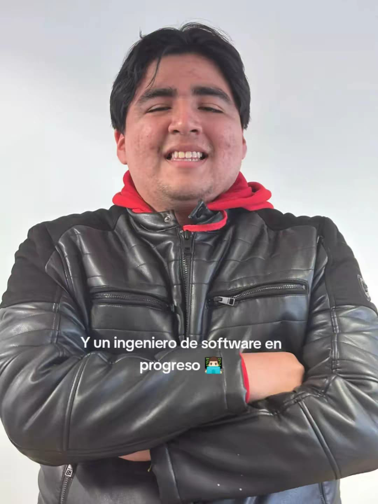

# Capítulo I: Introducción

## 1.1. Startup Profile

A continuación, se brindará información sobre a qué se dedica nuestra empresa, WASD.

### 1.1.1. Descripción de la Startup

WASD es una startup enfocada en la gestión inteligente del agua. Utilizamos tecnología IoT para optimizar el uso del recurso en negocio e instituciones. La compañía combina sensores, analítica de datos y una plataforma digital para transformar la manera en que las personas administran su agua.

- **Misión:** Ayudar a negocios e instituciones a optimizar el uso de agua, reducir desperdicios, disminuir costos y garantizar el reabastecimiento oportuno.
- **Visión:** Ser la empresa más importante en Perú, en el ámbito de gestión y optimización de agua con el uso de soluciones tecnológicas.
- **Producto:** "Qlic"  es un servicio el cual permite el monitoreo de puntos críticos del agua en un negocio o institución, optimizando el uso de líquidos, reduciendo desperdicios y disminuyendo costos además de garantizar el reabastecimiento oportuno.

### 1.1.2. Perfiles de integrantes del equipo

| Foto de perfil                                | Apellido y Nombre                       | Carrera                | Acerca de                                                                                                                  | Habilidades                                                              |
|-----------------------------------------------|-----------------------------------------|------------------------|----------------------------------------------------------------------------------------------------------------------------|--------------------------------------------------------------------------|
|    | Briceño Llanos, Ayrton Omar(u202311077) | Ingeniería de Software | Me apasiona el desarrollo de Software y la creación de soluciones tecnológicas que impacten positivamente en las personas. | Comunicación efectiva, trabajo en equipo, empatía, pensamiento crítico.  |
|  | Guia Carrasco, Pedro Andre              | Ingenieria de Software | Soy Pedro Guia, estudiante de la UPC. Estoy llevando mi cuarto año en la universidad y sigo firme a mis logros a futuro.   | Java, Python, HTML, CSS, JavaScript, Angular, MySQL                      |
|  | Loechle Arias, Mateo Italo              | Ingenieria de Software | Me interesa mucho el mundo de el desarrollo de software , y mejorar mis habilidades blandas con respecto a mi carrera.     | Java, Python , SQL , MongoDB, Sprinboot , Angular , Vue , Firebase, etc. |
|                                               |                                         |                        |                                                                                                                            |                                                                          |
|                                               |                                         |                        |                                                                                                                            |                                                                          |
|                                               |                                         |                        |                                                                                                                            |                                                                          |

## 1.2. Solution Profile

**Product Name:** Qlic   
**Product Description:** Qlic, es una Web App que tiene como objetivo optimizar la gestión del agua. Para ello, este permite al usuario monitorear los IoT que este tiene, mostrando información útil, ayudando a optimizar el uso de agua, reducir desperdicios, disminuir costos y garantizar el reabastecimiento oportuno. Qlic puede usarse en negocios e instituciones con el fin de optimizar varios procesos.
**Monetización:** Qlic funciona mediante un modelo de suscripción mensual o anual, en el cual se alquila el servicio de la aplicación y los diferentes dispositivos IoT.

**Plan Básico:**

Ideal para negocios que desean iniciar en la digitalización operativa con funciones esenciales.

- Dispositivos IoT para cada grifo de la casa.
- Reportes semanales del estado de los dispositivos IoT.
- Recomendaciones de cómo minimizar gastos.
- Cálculo del agua consumida mensualmente y especificaciones clave para conocer qué es lo que consume la mayor cantidad de agua.
- Instalación gratuita.
- Soporte técnico en horario laboral
- Monitoreo en tiempo real de temperatura y humedad en cámaras y vitrinas.

**Plan Gestión Pro:**

Pensado para instituciones que requieren mayor control, eficiencia operativa y soporte avanzado. Incluye todo lo del Plan Básico, más:

- Alertas inteligentes sobre fugas, exceso de consumo o fallas en los dispositivos.
- Reportes personalizados de consumo y comparativas por área o unidad.
- Monitoreo de inventario de agua en tanques con predicciones de reabastecimiento.

### 1.2.1 Antecedentes y problemática

**Antecedentes:**

**Problemáticas:**

**Técnica de The 5 'W's y 2 'H's**
**What?**  
**When?**  
**Where?**  
**Who?**  
**Why?**  
**How?**  
**How much?**  

### 1.2.2 Lean UX Process.

#### 1.2.2.1. Lean UX Problem Statements.

#### 1.2.2.2. Lean UX Assumptions.

#### 1.2.2.3. Lean UX Hypothesis Statements.

#### 1.2.2.4. Lean UX Canvas.

## 1.3. Segmentos objetivos.

### Segmento objetivo #1: 

**Descripción:**  
Este segmento está compuesto por propietarios de locales de tamaño pequeño y mediano que buscan optimizar la gestión operativa del agua que usan.

**Aspectos demográficos:**  
Este grupo está compuesto mayoritariamente por hombres y mujeres de entre 30 y 55 años, con un nivel socioeconómico medio-alto (B) y medio (C). En su mayoría, cuentan con educación técnica o universitaria, especialmente en áreas de administración, negocios o gastronomía.

**Aspectos geográficos:**  
Son peruanos que operan principalmente en zonas urbanas, con un enfoque particular en Lima.

**Aspectos psicográficos:**  
Valoran la eficiencia operativa, el control de gastos y la sostenibilidad. Son empresarios orientados a resultados.

**Necesidades:**  
Desean automatizar el control del agua, tener acceso a reportes claros en tiempo real, y recibir alertas sobre gastos innecesarios o uso indebido del agua.

**Requisitos:**  
Buscan una plataforma intuitiva, confiable y adaptable al flujo de trabajo de su local. Requieren acceso desde dispositivos móviles y soporte técnico constante.

**Objetivo:**  
Reducir el desperdicio del agua, mejorar la rentabilidad de su local y tomar decisiones estratégicas basadas en datos precisos.

**Sustento estadístico:**  
A nivel mundial, entre el 25 % y el 30 % del suministro total de agua se desperdicia debido a fugas en los sistemas de distribución Zipdo(2025).

### Segmento objetivo #2: 

