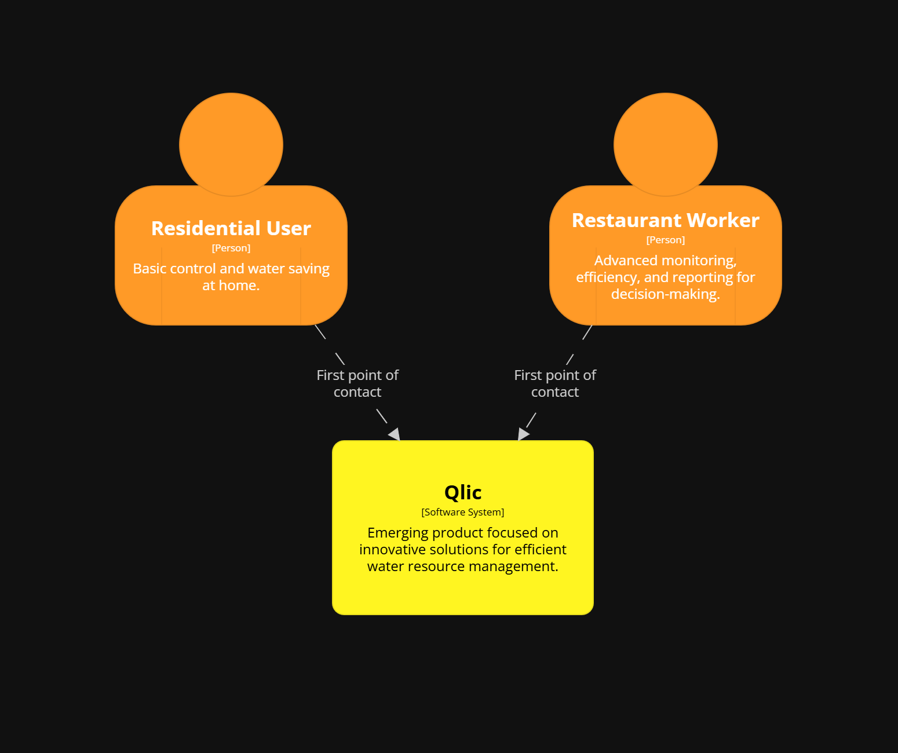
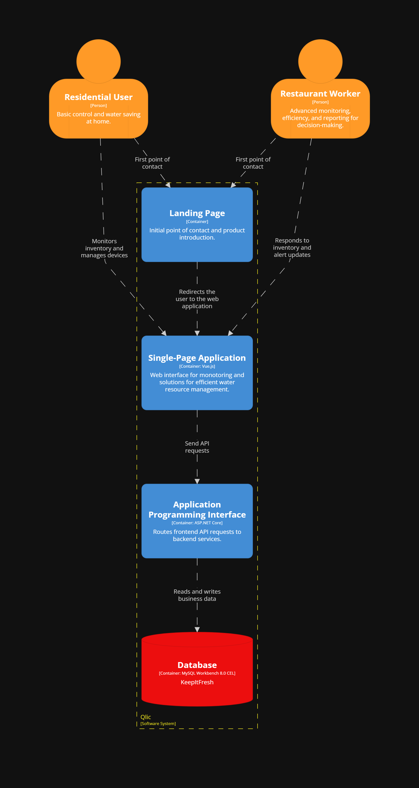
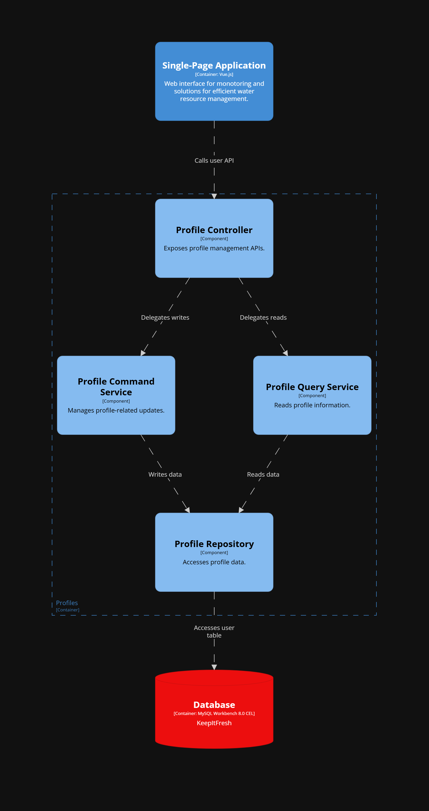
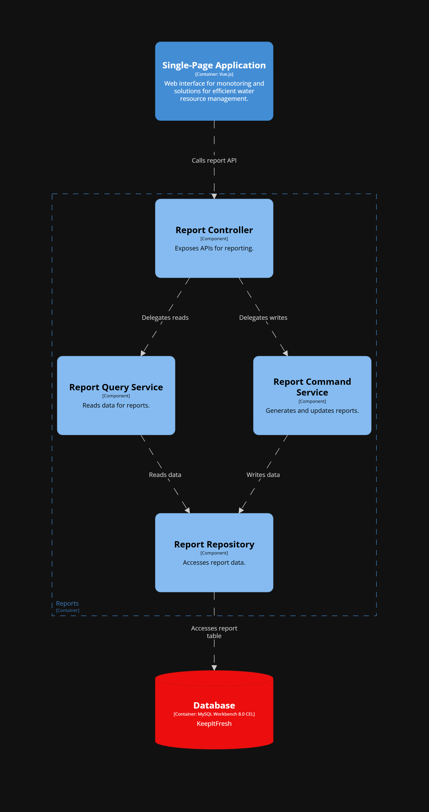
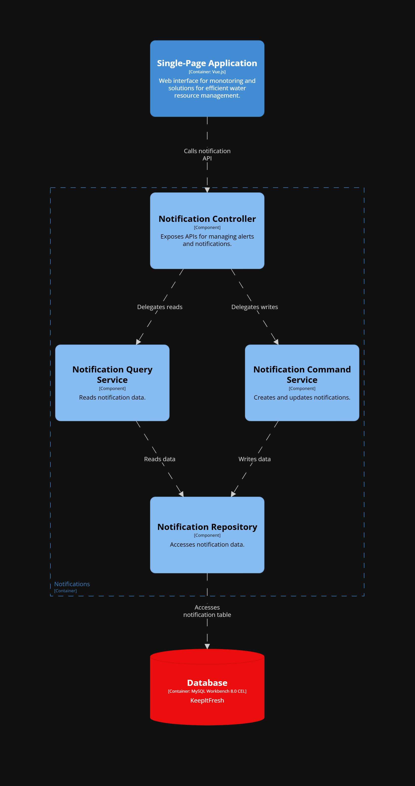
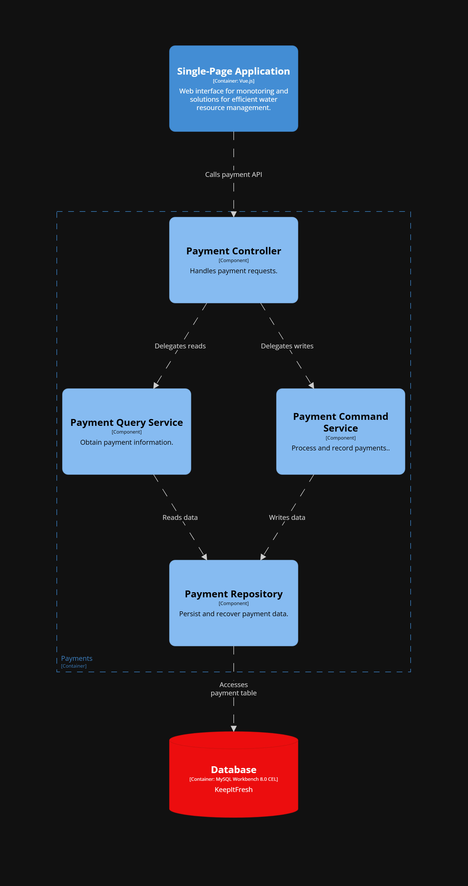
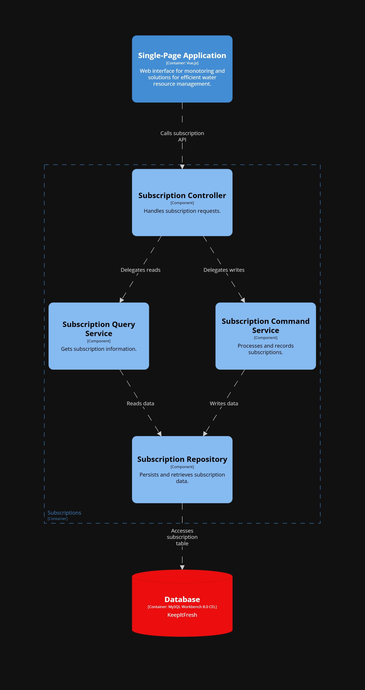
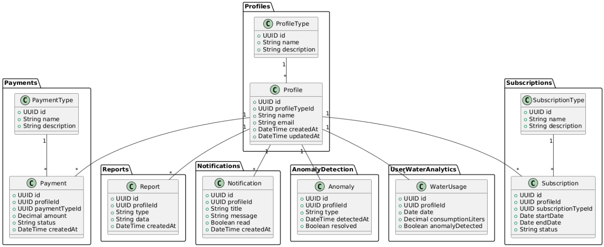
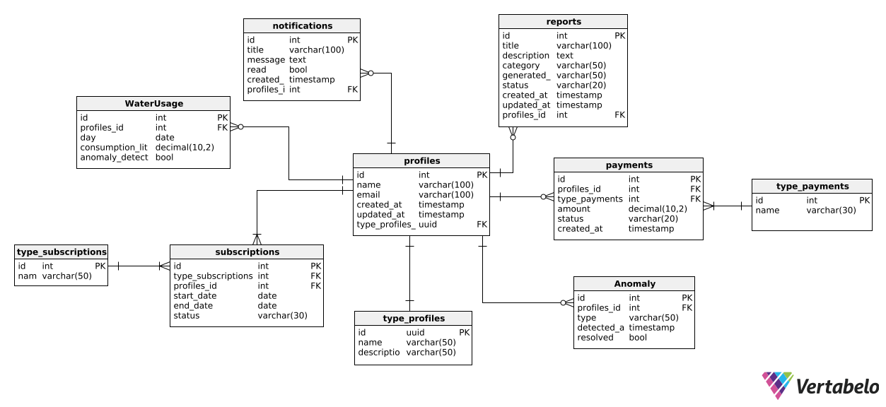

# Capítulo IV: Product Design

## 4.1. Style Guidelines
En esta sección, se presentan las pautas de estilo y diseño que guiarán la creación de la página web y la aplicación de Qlic. Estas pautas buscan asegurar una experiencia de usuario coherente, clara y atractiva, transmitiendo confianza y accesibilidad, en línea con la identidad de la marca y los objetivos del proyecto.

### 4.1.1. General Style Guidelines

**Tono de Comunicación:**  

- Confiable y profesional, para transmitir seguridad y respaldo a los usuarios.

- Cercano y empático, para generar confianza en la comunidad.

- Claro y directo, evitando tecnicismos que dificulten la comprensión.

- Enfocado en beneficios tangibles para homes y businesses.

**Tipografía:**  

**Poppins:** Para títulos y encabezados. Moderna, limpia y fácil de leer.

**Roboto:** Para párrafos y textos largos. Muy legible en web y móvil.

- Jerarquía tipográfica clara con tamaños contrastantes entre títulos y contenido.

**Colores de Marca:**  

**Primario:** Azul vibrante (#2563eb) – Color principal para navegación, header y elementos destacados.

**Secundario:** Azul oscuro – Para elementos de contraste, títulos y texto principal.

**Accento azul:** Azul medio (#3b82f6) – Para la mayoría de botones CTA como "Get Started", "Choose Plan".

**Accento verde:** Verde (#22c55e) – Uso específico para el botón "Send" del formulario de contacto.

**Neutro oscuro:** Gris oscuro/negro – Para textos principales y títulos de sección.

**Neutro claro:** Gris medio – Para textos secundarios y descripciones.

**Fondo:** Gradientes suaves y fondos claros – Para secciones de transición.

**Fondo principal:** Blanco y gris muy claro – Para contenido general.

**Paleta de Colores:**  

| Color | Código Hex | Uso Principal |
|-------|------------|---------------|
| Azul Principal | #2563eb | Header, navegación, elementos brand |
| Azul CTA | #3b82f6 | Botones principales: "Get Started", "Choose Plan", CTAs generales |
| Verde Específico | #22c55e | Botón "Send" del formulario únicamente |
| Azul Recomendado | #3b82f6 | Badge "Recommended" en plan Pro |
| Gris/Negro | #1f2937 | Textos principales y títulos de sección |
| Gris Medio | #6b7280 | Textos secundarios y descripciones |
| Fondo Claro | #ffffff/#f8fafc | Fondo general, cards, limpieza visual |

**Spacing y Layout:**  

- Espacios amplios entre secciones para evitar saturación.

- Márgenes y paddings consistentes para mantener jerarquía visual.

- Uso de cards con esquinas redondeadas (8-12px) y sombras suaves.

- Diseños con jerarquía clara: título > subtítulo > contenido.

- Layout centrado con máximo ancho para legibilidad óptima.

### 4.1.2. Web Style Guidelines

**Responsive Design:**  
La página es completamente adaptable a dispositivos móviles, tablets y desktops.
- Navegación hamburger para dispositivos móviles.
- Layouts flexibles que se adaptan a diferentes tamaños de pantalla.

**Componentes Implementados:**  

**Header:**

- Logo Qlic prominente en la esquina izquierda.

- Navegación horizontal con: Product, About Us, Team, Solutions, Features, Pricing, FAQ.

- Botón CTA "Contact Sales" destacado con fondo blanco.

- Selector de idioma (EN) en la esquina derecha.

**Hero Section:**

- Título principal impactante: "Smart liquid monitoring for homes and businesses".

- Descripción clara del valor: "Track volume, pressure, density and temperature in real time with clear alerts and reports".

- Botones duales: "Get Started" (azul primario) y "Learn More" (secundario transparente).

- Badge destacado "Real-Time Monitoring" en verde claro.

- Métricas de confianza horizontales: "Certified sensors • 99.9% uptime • Cloud dashboard".

- Dashboard visual oscuro del producto mostrando métricas en tiempo real:
    - Volume: 1,250 L
    - Pressure: 2.4 bar
    - Temperature: 12.6 °C
    - Density: 0.98 g/cm³

**Secciones de Contenido:**

**Full visibility of your liquids:** Descripción + tres cards con iconos azules:

- Volume Management: "Record levels, calculate consumption and predict replenishments".

- Pressure Tracking: "Detect pressure variations to prevent line damage".

- Temperature Control: "Ensure ideal ranges with smart alerts".

**About Us:**

- Descripción: "At Qlic we build sensor and software technology to provide total visibility of liquid usage. We believe in precise data, useful alerts and operational simplicity".

- Tres pilares con iconos rojos/amarillos/azules: Mission, Reliability, Customer focus.

- Imagen del dashboard a la derecha.

**Our team:** "Five pillars powering Qlic: engineering, hardware, data, product and operations".

- Cinco avatars circulares con iniciales: AB, PG, ML, JY, AA.

- Nombres completos debajo de cada avatar.

**Solutions by segment:** Dos cards principales:

- Residences: "Monitor water tanks, receive low-level alerts and prevent leaks".

- Businesses: "Control liquid inventories, audits and compliance in industries".

**Key features:** Tres cards con descripciones técnicas:

- Pressure Tracking: "Trends and safety thresholds with notifications".

- Temperature Control: "Custom ranges and thermal control for quality".

- Volume Management: "Consumption projections and replenishment logistics".

**Subscription plans:** Tres columnas con precios y características:

- Basic $19/mo: 1 tank, update every 15 min, basic alerts, email support.

- Pro $49/mo (Recommended): Up to 5 tanks, update every 5 min, advanced alerts, shared dashboards, priority support.

- Enterprise Custom: Unlimited tanks and sites, integrations and SLAs, exports and audits, 24/7 support.

**FAQ:** Sección con preguntas desplegables:

- "Which liquids can I monitor?"

- "Do I need constant internet?"

- "How do alerts work?"

**Contact Sales:**

- Descripción: "Tell us about your operation and a specialist will contact you".

- Formulario con campos: Name, Email, Message.

- Botón "Send" en verde (único botón verde del sitio).

**Footer:**

- Estructura en cuatro columnas bien definidas:
    - **Company:** About Us, Our Services, Privacy Policy, Affiliate Institutions.
    - **Get Help:** FAQ, Progress, Advisors, Payment Options.
    - **Community:** Our Story, Developers, Events.
    - **Follow Us:** Íconos de redes sociales (Facebook, Twitter, Instagram, YouTube).

- Copyright notice: "© 2025 Qlic. All rights reserved."

- Logo "Qlic" en la esquina inferior izquierda.

**Interacciones:**

- Hover effects en botones con transiciones suaves.

- Cards interactivas con sombras y efectos de hover.

- Formularios con feedback visual inmediato.

- Navegación suave entre secciones.

- Responsive design con adaptabilidad completa.

## 4.2. Information Architecture
La landing page se diseñó con un flujo lógico que guía al usuario desde el primer impacto visual hasta la acción final. La organización está pensada para usuarios tanto familiarizados como no familiarizados con la tecnología IoT, priorizando simplicidad, claridad y conversión.

**Orden lógico de las secciones:**

1. **Hero:** Primer impacto visual con título, subtítulo y botones CTA duales.

2. **Full visibility:** Descripción de las capacidades principales de monitoreo.

3. **About Us:** Presentación de la empresa con pilares de valor (Mission, Reliability, Customer focus).

4. **Our team:** Credibilidad a través del equipo técnico.

5. **Solutions by segment:** Diferenciación clara entre Residences y Businesses.

6. **Key features:** Funcionalidades técnicas detalladas.

7. **Subscription plans:** Estructura de precios clara con tres opciones.

8. **FAQ:** Resolución de dudas comunes.

9. **Contact Sales:** CTA final con formulario de contacto.

10. **Footer:** Información secundaria, enlaces legales y redes sociales.

### 4.2.1. Organization Systems

**Jerárquico:** Se organiza de lo más importante (valor del producto y CTA inicial) hacia lo más detallado (planes, FAQ, contacto).

**Secuencial:** Sigue un recorrido natural: Qué es → Quién somos → Soluciones → Características → Precios → Contacto.

**Por audiencia:** Diferenciación clara entre segmentos residencial y empresarial.

**Por funcionalidad:** Agrupación lógica de características técnicas.

### 4.2.2. Labeling Systems
Se emplean etiquetas claras, simples y orientadas al usuario para identificar cada sección.
  
**Etiquetas de navegación:**

- "Product"
- "About Us"
- "Team"
- "Solutions"
- "Features"
- "Pricing"
- "FAQ"
- "Contact Sales"

**Etiquetas de contenido:**

- "Smart liquid monitoring for homes and businesses"
- "Full visibility of your liquids"
- "Solutions by segment"
- "Key features"
- "Subscription plans"
- "Frequently asked questions"

### 4.2.3. SEO Tags and Meta Tags

**Title:** Qlic – Smart Liquid Monitoring for Homes and Businesses
**Description:** Monitor water, beer, gasoline and more with IoT sensors. Track volume, pressure, density and temperature in real time with clear alerts and reports.
**Keywords:** Smart monitoring, liquid management, IoT sensors, water monitoring, pressure tracking, temperature control, volume management, real-time alerts
**Meta Tags:**

- Viewport: width=device-width, initial-scale=1.0
- Charset: UTF-8
- Author: WASD Team
- Robots: index, follow
- Language: en-US, es-ES

### 4.2.4. Searching Systems

**Navegación por categorías:**

- La barra de navegación facilita acceso directo a todas las secciones principales.
- Categorización clara entre información del producto, empresa, equipo y precios.

**Búsqueda por contenido:**

- FAQ section para resolución rápida de dudas.
- Navegación anclada para acceso directo a secciones específicas.
- Breadcrumbs visuales a través del scroll.

### 4.2.5. Navigation Systems
**Barra de navegación principal:**
- Navegación horizontal sticky con acceso a todas las secciones
- Logo clickeable que regresa al inicio
- Botón "Contact Sales" prominente como CTA principal

**Botones de llamada a la acción (CTA):**
- Hero section: "Get Started" (azul primario) y "Learn More" (outline secundario)
- Planes de suscripción: "Choose Plan" (outline azul) en Basic y Enterprise, "Choose Plan" (azul sólido) en Pro
- Formulario de contacto: "Send" (verde - único botón verde del sitio)
- Distribución estratégica de CTAs en azul excepto el envío de formulario

**Footer navigation:**
- Enlaces organizados por categorías: Company, Get Help, Community, Follow Us
- Acceso a información legal, soporte y redes sociales
- Copyright y información corporativa

**Elementos de confianza:**
- Métricas destacadas: "99.9% uptime", "Certified sensors"
- Presentación completa del equipo técnico
- Testimonios implícitos a través de métricas de confiabilidad

## 4.3. Landing Page UI Design
### 4.3.1. Landing Page Wireframe
### 4.3.2. Landing Page Mock-up

## 4.4. Web Applications UX/UI Design
### 4.4.1. Web Applications Wireframes
### 4.4.2. Web Applications Wireflow Diagrams
### 4.4.2. Web Applications Mock-ups
### 4.4.3. Web Applications User Flow Diagrams

## 4.5. Web Applications Prototyping

## 4.6. Domain-Driven Software Architecture
### 4.6.1. Design-Level Event Storming
### 4.6.2. Software Architecture Context Diagram

### 4.6.3. Software Architecture Container Diagrams

### 4.6.4. Software Architecture Components Diagrams

- Profiles Component Diagram

- Reports Component Diagram

- Notifications Component Diagram

- Payments Component Diagram

- Subscriptions Component Diagram

## 4.7. Software Object-Oriented Design
### 4.7.1. Class Diagrams

## 4.8. Database Design
### 4.8.1. Database Diagrams

